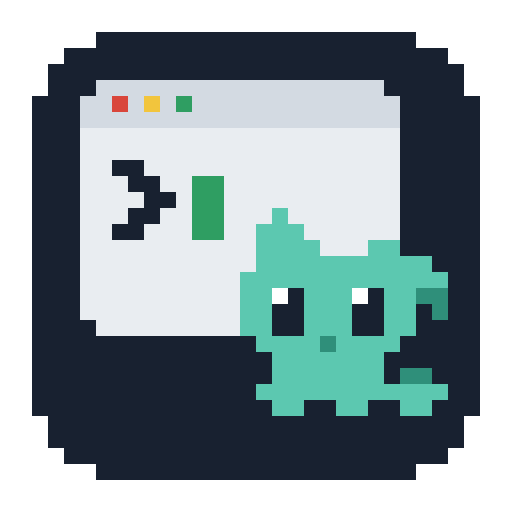

<div align="center">



# pokebuddy

**터미널 위에 떠 있는 포켓몬 펫**

터미널 창에 붙어 돌아다니고, 졸고, 만지면 반응한다.<br>
Claude Code · Codex CLI · Gemini CLI 안에서 띄우면 그 CLI 가 일하는 상태에 따라 동작이 바뀐다.


[설치](#설치) · [사용](#사용) · [옵션](#옵션) · [설명서](docs/guide.md)

</div>

---

## 설치

```bash
npm install -g pokebuddy
pokebuddy setup
```

`setup` 은 처음 한 번만 실행한다. 바꾸기 전에 백업을 남기고, 여러 번 실행해도 결과가 같다.

- **상태 훅** — 쓰고 있는 CLI(claude · codex · gemini)마다 `pokebuddy-state.cjs` 를 등록
- **탭 구분 확장** — VS Code 계열 에디터에 설치 (에디터 CLI 를 찾았을 때만)
- **데이터 폴더** — `~/.claude/pokebuddy` (설정·위치·그림 캐시)
- **실행 경로 기록** — `~/.claude/pokebuddy/cli.json` (확장이 창마다 펫을 띄울 때 쓴다)

미리 보기는 `pokebuddy setup --dry-run`, 되돌리기는 `pokebuddy uninstall [--purge]`.
npm 게시 전에는 `npm pack` 으로 만든 `.tgz` 를 설치한다 — [배포](docs/guide.md#배포-관리자용).
git clone 으로 쓰려면 [저장소에서 바로 쓰기](docs/guide.md#저장소에서-바로-쓰기-개발용) — 클론한 폴더의 `npm install` 이 TypeScript 빌드(`dist/`)까지 한다. 예전 `termimon` · `pkmon` 을 쓰고 있었다면 [옛 이름에서 옮겨 오기](docs/guide.md#옛-이름에서-옮겨-오기).

## 사용

일반 터미널에서는 그대로 치고, CLI LLM 안에서는 입력창에 `!` 를 붙인다.

```bash
pokebuddy eevee               # 일반 터미널 — 셸이 끝나면 사라진다
!pokebuddy eevee              # CLI LLM 안 — 그 CLI 가 끝나면 사라진다
!pokebuddy zapdos+pikachu     # 여러 마리 — 겹치지 않게 옆으로 놓인다
!pokebuddy eevee dot=3        # 떠 있는 펫이면 옵션만 바꿔 같은 자리에 다시 띄운다
!pokebuddy stop               # 내리기 — 여러 마리면 골라서
pokebuddy companion           # 동반자 — 어느 터미널을 보든 그 창의 에이전트를 따른다. 항상 위. 첫 실행이면 포켓몬 선택 창
pokebuddy companion           # 첫 실행이면 포켓몬 선택 창을 열고, 이후에는 저장된 파티를 복원
pokebuddy companion stop      # 동반자 내리기
```

| 명령 | 하는 일 |
|---|---|
| `pokebuddy <펫> [이름=값 ...]` | 이 세션에 펫을 더한다. 떠 있는 펫 이름이면 그 펫을 바꾼다 |
| `pokebuddy stop [펫 ...\|all]` | 이 세션의 펫을 내린다. 일반 터미널에서 여러 마리면 체크리스트로 고른다 |
| `pokebuddy status [펫]` | 훅 등록, 세션 판정, 떠 있는 펫, PMD 저작자를 한 번에 보여 준다 |
| `pokebuddy companion [buddy=값 click=값]` | 동반자를 띄운다. 포켓몬은 첫 실행 선택창에서 고르고, 이후 저장된 파티를 복원한다 |
| `pokebuddy companion stop` | 동반자를 내린다 |
| `pokebuddy setup` · `pokebuddy uninstall` | 설치 · 되돌리기 |

펫 이름은 [codex-pokepets 의 `pets/` 폴더명](https://github.com/dnnyngyen/codex-pokepets/tree/main/pets)을 쓴다 (`pikachu` · `gengar-3d` · `rotom-wash`).
없는 이름은 그 펫만 건너뛰고 비슷한 이름을 알려 준다.

## 무엇을 하나

- **창에 붙는다** — 터미널을 띄운 프로그램(VS Code · Cursor · iTerm2 · Windows Terminal …)의 창 오른쪽 아래에 놓인다. 지원 목록 없이 프로세스 조상으로 창을 찾는다
- **내 탭에서만 보인다** — VS Code 계열은 펫을 띄운 터미널 탭을 볼 때만 나타난다. 다른 앱이 위로 오면 겹친 부분만 가려진다
- **돌아다니고 존다** — 한가할 때는 가끔 천천히 걷고 두리번거린다. 입력이 5분 없으면 잠들고, 집어 들면 버둥거리고, 누르면 반응한다
- **CLI 가 일하면 바빠진다** — CLI 안에서 띄우면 훅이 알려 주는 상태를 따른다. 작업 중에는 빠르게 걷고 공격 · 기 모으기 같은, 한가할 때는 안 하는 동작을 이어 간다
- **동반자 하나가 모든 창을 따른다** — `pokebuddy companion` 은 세션에 묶이지 않는 펫을 하나 띄운다. 항상 위에 떠서 맨 앞 창이 터미널(VS Code · iTerm2 …)이면 그 창에 붙고, 그 창의 활성 터미널에서 도는 CLI 상태를 따른다. 브라우저를 봐도 마지막 자리에 남는다. 트레이 메뉴로 내린다
- **여러 마리가 한 무대에** — 동반자·창 펫은 파티 중 보이게 둔 마리(최대 6)를 따라가는 창 크기의 투명한 무대 창 하나에 함께 그린다. 마리마다 따로 끌어 옮기고, 겹치면 서로 비켜선다
- **돌본다** — 동반자·창 펫은 친밀도가 쌓인다. 켜 두기, 밥 주기·놀아주기, 콕 찌르기, claude·codex 가 일한 시간과 턴 완료가 원천이고 하루 상한이 있다. 친밀도는 줄지 않고 기분만 오르내린다. 지금은 무대 통합 중이라 적립이 멈춰 있다 — 다음 단계에서 되살리고 진화·상점이 이어진다
- **VS Code 창마다 펫** — 확장(0.3.0)이 창을 열 때 그 창의 펫을 띄운다. 그 창 위에만 보이고 그 창의 활성 터미널을 따르며, 창을 닫으면 사라진다. 동반자가 떠 있으면 띄우지 않는다. 설정 `pokebuddy.autoLaunch`, 명령 팔레트 `pokebuddy: 이 창에 펫 띄우기 · 내리기`

| 상태 | 언제 | 동작 (PMD) |
|---|---|---|
| `running` | 프롬프트 전송 · 도구 실행 · 승인한 도구가 끝남 | 빠른 걸음 · 작업 동작 (공격 · 기 모으기 …) |
| `waiting` | 승인 대기 · 질문에 답하기 | 두리번 |
| `waving` | 세션 시작 · 턴 끝 | 인사 (2초) |
| `failed` | 도구 · 턴 실패 (셸 명령의 0 아닌 종료 코드는 빼고) | 쓰러짐 |
| `idle` | 그 밖 · Esc 로 도구를 멈춤 | 대기 · 느린 산책 · 수면 |

훅이 없는 CLI 나 일반 터미널에서는 늘 한가한 것으로 보고 산책 · 수면 · 만지기 반응만 한다.
무대 창은 따라가는 창만큼 크지만 그림이 없는 곳의 클릭은 아래 창으로 통과한다.

## 옵션

`이름=값` 또는 `--이름 값`. **이번 실행에만 적용되고 설정 파일에는 저장되지 않는다.**

| 옵션 | 값 | 뜻 |
|---|---|---|
| `dot=` | 숫자 | 도트 한 칸의 px — 펫 크기. PMD 는 3~4 권장. 동반자·창 펫은 저장된 마리별 크기를 쓴다 |
| `buddy=` | `on` · `calm` · `off` | 돌아다니기 · 졸기 · 만지기 반응 |
| `keep=` | `on` · `off` | 다른 앱을 봐도 숨지 않기 |
| `click=` | `on` · `off` | 펫 위 클릭을 아래 터미널로 통과 |

같은 값을 환경변수 `POKEBUDDY_*` 로도 줄 수 있다. 전체 목록과 설정 파일은 [설명서 — 설정](docs/guide.md#설정).

## 단축키

| 키 | 동작 |
|---|---|
| <kbd>Cmd/Ctrl</kbd> <kbd>Alt</kbd> <kbd>P</kbd> | 클릭 통과 |
| <kbd>Cmd/Ctrl</kbd> <kbd>Alt</kbd> <kbd>K</kbd> | 항상 보이기 |
| <kbd>Cmd/Ctrl</kbd> <kbd>Alt</kbd> <kbd>H</kbd> | 숨기기 · 보이기 |
| <kbd>Cmd/Ctrl</kbd> <kbd>Alt</kbd> <kbd>Q</kbd> | 종료 |

전역 단축키는 먼저 뜬 펫 하나만 잡는다. 그 펫이 내려가면 남은 펫이 3초 안에 이어받는다.
동반자는 전역 단축키를 잡지 않는다 — 트레이와 우클릭 메뉴로 숨기고 내린다. 우클릭 메뉴(첫 줄 `이름 · 성격` · 잠시 숨기기 · 종료)는 모든 펫의 마리마다 있고, 트레이에는 고스트 모드(마우스 클릭을 무시)와 설정 파일 열기가 더 있다. 메뉴 문구는 한국어가 기본이고 `lang=en` 으로 영어를 쓸 수 있다.

## 그림

그림은 [PMDCollab/SpriteCollab](https://sprites.pmdcollab.org) 한 가지다. 종마다 동작이 10~40종이라 상태 동작 · buddy 가 된다.
포켓몬 이미지는 저장소에 없다. 처음 띄울 때 `~/.claude/pokebuddy/pmd/` 로 내려받아 캐시하고, 못 받은 종은 무대에 나오지 않는다(이유는 `pokebuddy status`).

## 요구사항

- Node.js 22.12 이상 (Electron 44 설치기 요구)
- macOS (Apple Silicon · Intel) 또는 Windows
- 상태 연동: Claude Code · Codex CLI 0.124+ · Gemini CLI 0.26+ 중 하나
- 탭별 표시: VS Code 계열 에디터 (VS Code · Cursor · Windsurf · Antigravity …)

## 설명서

| 주제 | 내용 |
|---|---|
| [설치](docs/guide.md#설치) | setup 이 바꾸는 파일, git clone 설치, PATH 설정 |
| [사용](docs/guide.md#사용) | 세션 규칙, 내리기 체크리스트, 옵션 · 환경변수 전체 |
| [펫은 언제 끝나는가](docs/guide.md#펫은-언제-끝나는가) | 세션 판정, pid 파일, 명령을 감싸지 않는 이유 |
| [동반자](docs/guide.md#동반자--독립-실행과-vs-code-창) | 독립 실행 · VS Code 창 펫 · 판정 규칙 · 수명 · 충돌 규칙 |
| [언제 보이고 언제 숨는가](docs/guide.md#언제-보이고-언제-숨는가) | z-order 배치, 창 추적 헬퍼, 지원 범위 |
| [CLI LLM 상태 연동](docs/guide.md#cli-llm-상태-연동) | CLI 별 훅 이벤트와 상태 매핑 |
| [buddy](docs/guide.md#buddy--돌아다니고-졸고-반응하기) | 산책 · 수면 · 반응 타이밍 |
| [화면 구조](docs/guide.md#화면-구조--무대-창-하나) | 무대 창 하나 · 여러 마리 · 클릭 통과 · 코드 자리 · 자체 확인 |
| [문제 확인](docs/guide.md#문제-확인) | `pokebuddy status`, 디버그 로그 |
| [배포 (관리자용)](docs/guide.md#배포-관리자용) | `npm pack`, 게시 전 확인 |
| [진행 현황](docs/progress.md) | 설계 단계별 진행 · 다음 작업 · 작업 방식 (개발용) |
| [설계 — 상주 동반자와 육성](docs/design.md) | 확정 결정, 세 층 구조, 친밀도 · 진화 · 상점, 마일스톤 |

## 라이선스

코드는 [MIT](LICENSE).

PMD 스프라이트는 [PMDCollab/SpriteCollab](https://github.com/PMDCollab/SpriteCollab) 기여자들의 작품이며 **CC BY-NC 4.0** 이다.
저장소에 넣지 않고 실행할 때 사용자 컴퓨터로 받아 캐시만 한다. 펫별 저작자는 `pokebuddy status <펫>` 으로 확인한다.
포켓몬 권리는 Nintendo · Game Freak · Creatures Inc. 에 있으며, 개인 · 비상업 팬 용도로만 쓴다.
