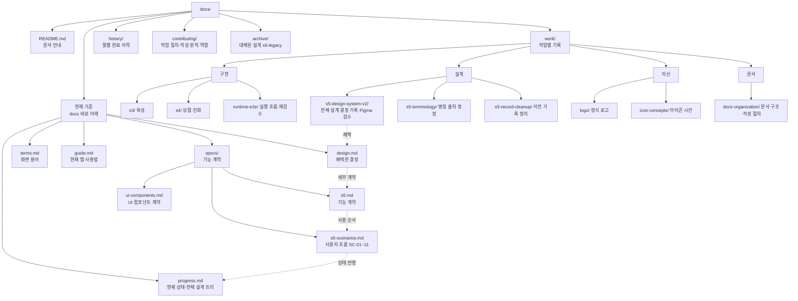

# 문서 안내

이 폴더는 현재 기준과 작업 기록을 보관한다. 새 작업을 시작하면 이 문서와 [현재 현황](progress.md)을 읽는다.
다른 PC에서 이어갈 때는 [재개 안내](progress.md#다른-pc에서-재개)부터 확인한다.

## 현재 기준

| 문서 | 기록할 내용 |
|---|---|
| [design.md](design.md) | 현재 구조와 채택한 결정 |
| [progress.md](progress.md) | 현재 상태, 열린 문제, 다음 행동 |
| [terms.md](terms.md) | 화면 용어와 채택 여부 |
| [guide.md](guide.md) | 현재 앱의 사용 방법 |
| [specs/s5.md](specs/s5.md) | S5 기능 계약과 미확정 제안 |
| [specs/s5-scenarios.md](specs/s5-scenarios.md) | S5 사용자 흐름, 예외, 수용 조건과 열린 결정 |
| [specs/ui-components.md](specs/ui-components.md) | 화면에서 반복되는 UI 컴포넌트 계약과 Figma 자산 판정 |

완료한 작업의 설명을 이 문서들에 반복해서 넣지 않는다. 상세 근거는 작업 기록으로 연결한다.

## 문서 트리

2026-09-22 기준 전체 문서 구조다. Figma 사본은 [06 · 전체 설계·문서 트리](https://www.figma.com/design/MA3K41Y6omAi5mRu6YDFly/pokebuddy?node-id=236-121) 페이지에 있다. 사본과 이 그림이 다르면 이 그림을 따른다. 실선은 폴더 구성이다. 점선은 결정이 기록되는 순서다. 사용자 발언을 작업 기록에 남긴다. 채택한 결정을 설계에 옮긴다. 세부 계약과 흐름을 기능 문서에 적는다. 현재 상태를 진행 현황에 적는다.
설계 영역별 확정·미정 상태는 [전체 설계 트리](progress.md#전체-설계-트리)를 따른다. `s5` 이름의 파일과 폴더는 S5 설정창 설계에서 시작했다. 현재는 프로젝트 전체의 재설계 결정도 담는다.

## 기록 위치

| 위치 | 용도 |
|---|---|
| [work/](work/README.md) | 기능별 설계·작업·검수·피드백·수정 기록 |
| [history/](history/README.md) | 월별 완료 이력 |
| [contributing/workflow.md](contributing/workflow.md) | 파일 생성·갱신·보관 절차 |
| [contributing/writing.md](contributing/writing.md) | ASD-STE100에서 가져온 한국어 작성 원칙과 검수 항목 |
| [archive/](archive/s5-legacy/README.md) | 대체된 설계·시안. 현재 지시로 사용하지 않는다. |

`docs/` 바로 아래에는 위의 현재 기준 문서와 이 안내만 둔다. 기능 계획은 `specs/`에 둔다. 관측 JSON과 캡처는 해당 작업의 `evidence/`에 둔다.

## 근거 판단

- 사용자 의도는 직접 발언으로 확인한다. 구현이나 과거 문서만으로 사용자 승인을 추정하지 않는다.
- 실제 동작은 코드·설정·관련 검사 결과로 확인한다.
- Figma 관측은 화면 속성의 근거다. 앱 구현이나 게임 규칙의 승인 근거가 아니다.
- 결정은 `design.md`에서 관리한다. 진행 상태는 `progress.md`에서 관리한다.
- 서로 다른 기록이 충돌하면 날짜와 적용 범위를 먼저 확인한다.
- 과거 기록이 틀리면 정정 날짜와 근거를 추가한다. 과거 검수 결과를 새 결과로 덮어쓰지 않는다.

## 완료 전 확인

1. [작성 검사표](contributing/writing.md#완료-전-의미-검수)를 적용한다.
2. `node scripts/check-docs.cjs`를 실행한다.
3. `git diff --check`를 실행한다.
4. 해당 작업 기록에 검사 범위와 남은 문제를 적는다.

자동 검사는 구조와 파일 참조를 확인한다. 문장의 의미나 ASD-STE100 준수 여부를 판정하지 않는다.
