# 현재 작업 현황

갱신: 2026-09-22
현재 구현: S4
S5 기능 구현: 미시작

## 먼저 읽을 문서

- [현재 설계](design.md)
- [S5 기능 계약](specs/s5.md)
- [명칭과 채택 상태](terms.md)
- [문서 작업 절차](contributing/workflow.md)

## 다른 세션에서 재개

인계 기준일: 2026-09-22. 현재는 프로젝트 전체의 제품 규칙과 사용자 시나리오를 설계하는 단계다. 앱 구현은 미시작이다. Figma에는 [06 · 전체 설계·문서 트리](https://www.figma.com/design/MA3K41Y6omAi5mRu6YDFly/pokebuddy?node-id=236-121) 페이지를 추가했다. 화면 편집은 미시작이다.
같은 작업 폴더의 새 세션은 아래 문서를 읽으면 이어갈 수 있다. 설계 문서와 참고 자료를 중간 저장 커밋으로 관리한다. 원격 반영 여부는 `git status -sb`와 `git log -1 --oneline`으로 확인한다.

1. 이 문서의 다음 행동과 [전체 설계 트리](#전체-설계-트리)를 읽는다.
2. [현재 설계](design.md)와 [S5 기능 계약](specs/s5.md)에서 확정 규칙을 확인한다.
3. [사용자 시나리오](specs/s5-scenarios.md)의 SC-01~SC-11과 Q-01~Q-08을 읽는다.
4. [작업 기록](work/s5-design-system-v2/plan.md)에서 필요한 결정의 발언과 정정을 확인한다. [열린 항목](work/s5-design-system-v2/feedback.md)에서 남은 검토 범위를 확인한다.
5. 사용자와 질문 하나·답변 하나씩 이어간다. 답변을 기록한 뒤 다음 질문으로 넘어간다. 과거 제안을 승인으로 취급하지 않는다. 기능 구현을 자동으로 시작하지 않는다.

2026-09-21 요청: 두 번째 파티 확장 업적의 조건은 계속 미정으로 둔다. 상점 칸 2개 구매 조건은 채택하지 않았다. 코스모움 두 개체 획득 구상은 채택하지 않았다. 기존 공유 `sid`와 두 종 동시 제공·도감 기록을 유지한다.

2026-09-22 결정:

- 부화·진화·교체도 구매·사용·수령과 같은 거래 원칙을 따른다. 부화 실패 후 다시 열면 그 시점의 조건으로 결과를 새로 정한다. [근거](work/s5-design-system-v2/plan.md#부화·진화·교체의-트랜잭션-적용)
- 확정 전 취소는 상태를 바꾸지 않는다. 공유 `sid` 종 교체·첫 선택·놀이공간 적용도 실패 시 이전 상태를 유지한다. [근거](work/s5-design-system-v2/plan.md#확정-전-취소와-남은-저장-실패의-처리)
- 업적 보상은 한 번만 받는다. 받지 않은 보상은 기한 없이 유지한다. [근거](work/s5-design-system-v2/plan.md#업적-보상의-1회-수령과-미수령-유지)
- 업적 튜토리얼을 제거했다. 업적 배너의 `바로가기`로 업적창에 이동한다. [근거](work/s5-design-system-v2/plan.md#업적-배너의-바로가기와-업적-안내-제거)
- 업적 배너는 우측 아래에 한 번 뜬다. 미수령 보상이 있으면 업적창 아이콘에 dot를 표시한다. [근거](work/s5-design-system-v2/plan.md#업적-알림의-우측-아래-표시와-업적창-dot)
- 앱 종료로 끊긴 튜토리얼은 재실행 후 처음부터 다시 보여준다. [근거](work/s5-design-system-v2/plan.md#앱-종료로-끊긴-안내의-처음부터-재표시)
- 튜토리얼 조건은 발생 순서로 보여준다. 같은 순간이면 첫 돌봄 → 상점 → 부화 → 파티 → 놀이공간 순서다. [근거](work/s5-design-system-v2/plan.md#동시-안내-조건의-발생-순서와-흐름-우선순위)
- 놀이공간 튜토리얼은 첫 돌봄 튜토리얼이 끝나면 시작한다. [근거](work/s5-design-system-v2/plan.md#놀이공간-튜토리얼의-시작-계기)
- 대기 중 대상이 처리된 배너는 표시하지 않는다. 표시 전 종료된 배너는 재실행 후 이어서 표시한다. [근거](work/s5-design-system-v2/plan.md#대기-배너의-무효화와-재실행-처리)
- 배너는 먼저 생긴 것부터 표시한다. 같은 순간이면 부화 → 진화 → 업적 순서다. [근거](work/s5-design-system-v2/plan.md#배너-동시-발생의-표시-순서)
- 관리 창의 탭은 파티 / 박스 / 도감 / 상점 / 가방이다. 업적창과 설정은 헤더 아이콘으로 여는 모달이다. 박스는 별도 메뉴이며 돌보미집을 그 안에 둔다. [박스 메뉴 분리](work/s5-design-system-v2/plan.md#박스-메뉴-분리) [근거](work/s5-design-system-v2/plan.md#관리-창의-탭과-헤더-구성)
- 박스 개체 상세의 `파티에 배치`·`교체`, 파티 상세의 `교체`, 빈 파티 칸은 같은 개체 선택 창으로 이어진다. [근거](work/s5-design-system-v2/plan.md#박스와-파티-사이-배치교체-흐름)
- 박스는 30칸(6×5) 박스 여러 개로 나누고 넘겨 본다. 모두 차면 새 박스가 생긴다. 검색은 모든 박스를 대상으로 한다. [근거](work/s5-design-system-v2/plan.md#원작식-박스-구조와-검색)
- 우클릭 메뉴는 포켓몬 위에서만 연다. 빈 놀이공간의 우클릭은 뒤 앱으로 넘긴다. 메뉴에 종료는 없고 구분선으로 묶음을 나눈다. [근거](work/s5-design-system-v2/plan.md#포켓몬-위-우클릭-메뉴)
- 상점 카드를 누르면 구매 창이 열린다. 여러 개 사는 상품은 수량과 합계를 확인한다. 0P 상품은 `받기`다. 구매 불가는 구매 창에서 이유와 비활성 `구매`로 보여준다. [근거](work/s5-design-system-v2/plan.md#검수-p2-결정-항목)
- 설정의 `로그인 시 시작`은 기본값을 켜짐으로 둔다. [근거](work/s5-design-system-v2/plan.md#로그인-시-시작의-기본값-켜짐)
- 자동기능 없음은 게임 진행을 대신 해 주는 기능이 없다는 뜻이다. [근거](work/s5-design-system-v2/plan.md#자동기능-없음의-범위)
- 알 돌봄 행동은 쓰다듬기와 노래 들려주기다. 부화시간 단축 도구는 채택하지 않았다. [근거](work/s5-design-system-v2/plan.md#알-돌봄-행동의-채택)
- 진화의돌을 채택했다. 돌로 진화하는 종은 가방에서 돌을 사용한다. [근거](work/s5-design-system-v2/plan.md#진화의돌-채택)
- 민트를 유지한다. 가방에서 대상과 성격을 골라 사용한다. [근거](work/s5-design-system-v2/plan.md#민트-유지)
- 오래 놀아주기는 10초 안에 이어 약 30초 놀아주면 버프가 켜진다. [근거](work/s5-design-system-v2/plan.md#오래-놀아주기-버프와-장난감-채택)
- 오래 놀아주기 버프는 프리미엄먹이보다 낮은 친밀도 버프다. 장난감은 1회성이다. [근거](work/s5-design-system-v2/plan.md#오래-놀아주기-버프-효과와-1회성-장난감)
- 장난감은 가방에서 드래그해 포켓몬 위에 드롭하며 오래 놀아주기와 같은 버프를 준다. [근거](work/s5-design-system-v2/plan.md#장난감의-드래그-사용과-같은-버프)
- 튜토리얼은 `튜토리얼`로만 부른다. [근거](work/s5-design-system-v2/plan.md#튜토리얼-용어-통일)
- 전체 설계 트리와 문서 트리를 프로젝트 전체 기준으로 작성했다. [근거](work/s5-design-system-v2/plan.md#전체-설계-트리로-범위-정정)

마지막 요청: 2026-09-22 결정을 중간 저장으로 커밋·푸시한다. 이어서 저해상도 와이어프레임을 Figma 새 페이지에 작성한다.
재개 방향: 와이어프레임 검수 반영은 끝났다. 2026-09-23 시나리오의 빈 화면을 추가했다. 새 화면의 `[스펙 미확정]` 제안을 사용자와 검토한다. [UI 컴포넌트 계약](specs/ui-components.md)의 수정 6개와 C-02를 Figma에 반영했다. 반영 결과를 사용자와 검토한다. 이어서 신규 컴포넌트를 만든다. 두 번째 업적은 사용자가 구상을 정할 때까지 보류한다. 가격·성장 곡선·확률은 밸런스 설계로 남긴다.

재개 요청 예시:

> docs/progress.md의 다른 세션에서 재개 안내를 읽고 전체 설계를 이어가자. 두 번째 파티 확장 업적은 미정으로 보류해. 07 · 와이어프레임 검토부터 진행해줘. 아직 구현하지 마.

## 다른 PC에서 재개

인계 기준일: 2026-09-22. 작업 브랜치는 `main`이다.

1. 작업 폴더의 변경을 먼저 확인한다. 로컬 변경이 없는 `main`에서 `git pull --ff-only origin main`으로 최신 설계 커밋을 받는다. 로컬 변경이나 분기 이력이 있으면 먼저 보존·동기화한다.
2. `git status --short`와 `git log -3 --oneline`으로 상태를 확인한다. 시나리오 `docs/specs/s5-scenarios.md`와 참고 자료 `docs/work/s5-design-system-v2/evidence/candy-references/`도 함께 받았는지 확인한다.
3. 위의 다른 세션 재개 절차를 따른다. 앱 실행 환경이 필요하면 [기존 실행 흐름 재개 절차](work/runtime-e2e/record.md#다른-pc의-재개-절차)를 별도로 읽는다. 해당 기록은 이번 설계 결정의 출처가 아니다.
4. 동기화 후 `node scripts/check-docs.cjs`와 `git diff --check`를 실행한다. 과거 검수 결과를 새 PC의 실행 결과로 사용하지 않는다.

현재 앱은 S4다. S5는 화면과 기능 계약을 정리한 단계다. Figma 작업 완료 여부와 앱 구현 완료 여부를 구분한다.

## 현재 상태

| 범위 | 상태 | 근거 |
|---|---|---|
| S3 육성 | 구현과 당시 자동 검사를 완료했다. | [S3 검수](work/s3/review.md) |
| S4 상점·진화 | 구현과 당시 자동 검사를 완료했다. 기준 커밋은 `85daaa7`이다. | [S4 검수](work/s4/review.md) |
| 기존 실행 흐름 | Windows에서 동반자 실행 흐름을 재검수했다. CLI와 저장 실패 처리를 수정했다. | [범위와 결과](work/runtime-e2e/record.md) |
| S5 화면 | Figma 관측을 완료했다. 디자인 문제 12개가 열려 있다. | [v2 검수](work/s5-design-system-v2/review.md), [열린 항목](work/s5-design-system-v2/feedback.md) |
| S5 명칭 | 용어사전을 개념별로 정리했다. 기존 설계와 미확정 명칭을 구분했다. 상품 후보의 채택은 미정이다. | [용어사전](terms.md), [정정과 검수](work/s5-terminology/review.md) |
| 요청 #119 | 지정한 상품의 코드와 문서 참조를 제거했다. 빌드와 관련 검사 4종을 통과했다. | [삭제와 검수](work/s5-terminology/review.md#2026-09-21--요청-119-삭제) |
| 전체 설계 트리 | 전체 설계·문서 트리를 저장소와 Figma 06 페이지에 작성했다. | [전체 설계 트리](#전체-설계-트리), [기록](work/s5-design-system-v2/plan.md#전체-설계-트리로-범위-정정) |
| 문서 운영 | 현재 기준과 작업 기록을 분리했다. 작성 검수를 작업 절차에 추가했다. | [구조 정리](work/docs-organization/record.md) |
| S6 배포 | 대기 중이다. | 아래 플랫폼 확인 목록 |

과거 검사 결과와 이번 재검수 결과는 각 기록에서 구분한다. 현재 창·명령 사용 방법은 [설명서](guide.md)를 따른다.
마리별 크기는 저장한다. `pet.set size=3` 명령은 아직 구현하지 않았다.

## 다음 행동

2026-09-21: 핵심 제품 규칙과 [S5 사용자 시나리오](specs/s5-scenarios.md)의 SC-01~SC-11 초안을 정리했다. 정상 흐름과 주요 분기는 기록했다. 예외 처리와 실제 콘텐츠·수치 검증은 남아 있다. 설계 전체 완료를 뜻하지 않는다.
제품 결정은 [현재 설계](design.md)를 따른다. 사용자 발언과 정정은 [기존 작업 기록](work/s5-design-system-v2/plan.md)에 보존한다.

| 범위 | 현재 상태 | 남은 작업 |
|---|---|---|
| 일상·돌봄·파티·박스 | 기본 규칙과 숨김·보관·시간 정지를 확정했다. | 먹이·버프 수치, 상태 전환의 저장 정밀도와 동시 사건 처리 |
| 알·획득·도감·진화 | 후보 저장, 행동 조건, 직접 부화·진화, 리전폼과 이로치 규칙을 정리했다. | 실제 종별 조건표, 공유 계열 박스 표시와 다른 제공 묶음, 연쇄 해금 검증 |
| 경험사탕·이상한사탕 | 종류, 초기 상점 판매, 입수 경로, 제한 없는 공통 가방 보관, 사용 대상, 최대 레벨, 결과 미리보기와 여러 개 사용을 확정했다. | 사탕 가격·보상표, 경험사탕 효과량, 성장 곡선, 큰 수량 표시·저장 방식·화면 조작 |
| 튜토리얼·업적·알림 | 주요 시작 조건, 스킵, 직접 보상 수령, 업적당 1회 수령과 미수령 유지, 끊긴 튜토리얼의 재표시, 동시 튜토리얼 순서, 개별 배너와 소리 정책, 대기 배너 처리, 배너 표시 순서, 업적 배너 `바로가기`·우측 아래 표시·업적창 dot와 업적 튜토리얼 제거를 확정했다. | 튜토리얼 내용·대기 튜토리얼 표시 위치, 두 번째 파티 칸 업적, 배너 표시 시간 |
| 실패·재개 | 구매·사용·수령·부화·진화·교체의 원자성과 완료 동작 재시도의 중복 방지를 확정했다. 확정 전 취소와 공유 `sid` 종 교체·첫 선택·놀이공간의 실패 처리도 확정했다. | 거래 식별·저장 방식, 실패 표시·결과 불명 내부 판정 |
| 화면·모듈 | 시나리오별 담당 영역 초안을 작성했다. 관리 창의 탭·헤더 구성을 확정했다. 저해상도 와이어프레임 WF-01~WF-09를 작성했다. 2026-09-23 시나리오의 빈 화면 WF-10~WF-15와 가방 도구 장면을 추가했다. [근거](work/s5-design-system-v2/plan.md#시나리오-빈-화면-와이어프레임) | 와이어프레임의 사용자 검토, 컴포넌트 계약, 모듈 경계, Figma 탭 반영 |
| 밸런스·확장 | 에이전트 보상은 추가 이득이다. 던전은 향후 확장이다. | 가격·성장 속도·토큰 보상 비교, 저장 이식 계약 |

재개 순서:

1. 두 번째 파티 칸 업적 조건은 보류한다. 나머지 저장·화면 흐름의 미정 사항부터 질문 하나씩 이어간다. 가격 수치는 경제 설계에서 함께 비교한다.
2. [시나리오 결정 목록](specs/s5-scenarios.md#이번-설계에서-남긴-결정)의 Q-01~Q-03을 보완한다. 이미 확정한 초기 해금과 알 결과 결정 시점은 다시 묻지 않는다. 실제 목록·가격 검증과 저장·재시도 처리가 남아 있다.
3. 남은 SR 항목과 정상·취소·실패 수용 조건을 정리한다. 사용자 결정이 필요한 항목과 구현 계약으로 정할 항목을 구분한다.
4. 관리 창의 탭·헤더 구성은 확정했다. 저해상도 와이어프레임 WF-01~WF-08을 [07 · 와이어프레임](https://www.figma.com/design/MA3K41Y6omAi5mRu6YDFly/pokebuddy?node-id=252-121)에 작성했다. 사용자 검토를 받는다. 흐름 ID를 화면과 수용 검사에 연결한다.
5. 반복 표현에서 컴포넌트 계약을 추출한다. 2026-09-23 [UI 컴포넌트 계약](specs/ui-components.md) 초안 22개를 작성하고 기존 Figma 자산을 재사용·수정·신규로 판정했다. 2026-09-23 수정 6개와 C-02를 Figma에 반영했다. [근거](work/s5-design-system-v2/plan.md#ui-컴포넌트-수정-6개-figma-반영) 반영 결과를 검토한 뒤 나머지 신규 컴포넌트를 만든다. 모듈 책임은 별도로 정한다.
6. 가격·성장 속도와 저장 이식 계약을 정한다. 이후 확정한 흐름부터 구현한다.

시나리오 검토 항목은 SR-01·02·05·06·08·09·10의 7개가 열려 있다. SR-03·04는 설계 보완을 완료했다. SR-07은 단일 종의 알 입수 제외로 해당하지 않는다. 상세 잔여 범위는 [피드백](work/s5-design-system-v2/feedback.md#시나리오-설계-후속-항목)을 따른다.
기존 Figma의 V2-01~V2-12 문제 12개는 별도다. 이번 시나리오 보완으로 해결된 것으로 표시하지 않는다. 새 흐름에 맞는 자산 재사용 여부를 판단한 뒤 처리한다.
이번 작업은 설계 문서 검사만 실행한다. 기존 구현 검수는 해당 기록의 환경과 범위에만 적용한다.

## 전체 설계 트리

2026-09-22 기준 프로젝트 전체 설계의 요약이다. 위 다음 행동 표를 설계 영역별로 펼친 그림이다. Figma 사본은 [06 · 전체 설계·문서 트리](https://www.figma.com/design/MA3K41Y6omAi5mRu6YDFly/pokebuddy?node-id=236-121) 페이지에 있다. 그림과 기준 문서가 다르면 [현재 설계](design.md)와 이 문서의 표를 따른다.
현재 구현은 S4다. 새 설계의 기능 구현은 미시작이다. S6 배포는 대기 중이다. 초록은 사용자가 확정한 규칙이다. 노랑은 열린 결정이다. 회색은 사용자가 보류한 항목이다. 보라는 향후 확장이다.

```mermaid
flowchart LR
  ROOT["pokebuddy 전체 설계<br/>PC에서 노는 포켓몬을 구경하다<br/>잠깐 돌보며 쉬어 가는 방치형 경험"]
  ROOT --> G1["게임 규칙"]
  ROOT --> G2["제품·시스템"]
  ROOT --> G3["밸런스·확장"]

  G1 --> A2["일상·돌봄<br/>SC-02·08"]
  G1 --> A3["파티·박스<br/>SC-05·07"]
  G1 --> A4["알·부화<br/>SC-03·04"]
  G1 --> A5["성장·진화<br/>SC-06"]
  G1 --> A6["도감·획득<br/>SC-01·09"]
  G1 --> A7["튜토리얼·업적·알림<br/>SC-01·05·10"]
  G2 --> A1["제품·실행<br/>전체"]
  G2 --> A8["거래·저장<br/>전체"]
  G2 --> A9["에이전트 연결<br/>SC-11"]
  G2 --> A10["화면·모듈<br/>전체"]
  G3 --> A11["밸런스"]
  G3 --> A12["확장"]

  A2 --> C2["놀이공간 기본 화면 전체 + 영역 지정<br/>기본먹이 무료·무제한, 개체별 쿨타임<br/>프리미엄먹이 버프 갱신<br/>배고픔 말풍선 1회, 숨김은 파티창 표시<br/>잠금·절전·종료 중 시간 정지<br/>오래 놀아주기: 10초 안에 이어 약 30초<br/>오래 놀아주기 버프는 프리미엄먹이보다 낮게<br/>장난감: 1회성, 가방에서 드래그해 드롭<br/>장난감 버프 = 오래 놀아주기 버프"]
  A2 --> O2["먹이·버프·만복도 수치<br/>디버프 배율·구간<br/>두 버프의 배율·지속시간<br/>장난감 입수처·가격<br/>영역 드래그 조작"]
  A3 --> C3["2칸 시작, 구매 2 + 업적 2, 최대 6칸<br/>숨김은 파티 유지, 박스는 적립 정지·보존<br/>새 개체·교체 개체는 숨김 배치<br/>같은 종 여러 개체 보유"]
  A3 --> O3["칸 가격<br/>박스 화면<br/>빈 칸 배치 순서"]
  A3 --> H3["두 번째 업적 칸 조건"]
  A4 --> C4["구매 시 후보 범위 저장<br/>돌보미집 6칸<br/>최대 5분 준비 후 직접 열기<br/>알 돌봄: 쓰다듬기·노래 들려주기<br/>행동 조건·발견, 난이도 가중치<br/>이로치 별도 추첨"]
  A4 --> O4["알 가격·확률<br/>종별 행동 조건표<br/>돌봄별 단축량"]
  A5 --> C5["친밀도와 경험치 분리<br/>친밀도에 따른 포인트 적립 간격<br/>사탕 6종 초기 판매·공통 가방<br/>최대 레벨 100<br/>한 단계씩 직접 진화, 리전폼·공유 sid<br/>돌 진화 종은 진화의돌 사용<br/>민트로 성격 변경"]
  A5 --> O5["사탕 효과량·가격<br/>성장 곡선<br/>종별 진화 조건<br/>진화의돌 종류·가격, 민트 가격"]
  A6 --> C6["첫 선택 후보 초기 해금<br/>종별 입수처<br/>단일 포켓몬 1회, 알 제외<br/>리전폼 별도 도감 항목<br/>이로치 획득 기록"]
  A6 --> O6["실제 후보·종 목록<br/>특수 기믹<br/>연쇄 해금 평가"]
  A7 --> C7["행동별 단계 튜토리얼, 업적 튜토리얼 없음<br/>닫기는 스킵, 다시보기 대신 가이드북<br/>끊긴 튜토리얼 처음부터, 동시 튜토리얼 순서<br/>업적 1회 수령·미수령 유지<br/>업적 배너 우측 아래, 바로가기, 미수령 dot<br/>배너 개별·대기·순서, OS 알림음"]
  A7 --> O7["튜토리얼 내용·표시 위치<br/>배너 표시 시간<br/>가이드북 구성"]
  A1 --> C1["상주 Electron 앱 + VS Code 확장<br/>앱이 런타임·저장 담당<br/>투명 창 하나에 최대 6마리<br/>종료 중 정지, 재실행 시 이어가기<br/>로그인 시 시작 기본 켜짐<br/>게임 진행 자동기능 없음"]
  A1 --> O1["여러 VS Code 창의 파티 배분<br/>OS별 로그인 시작 등록"]
  A8 --> C8["구매·사용·수령·부화·진화·교체는<br/>전부 반영 또는 이전 상태 유지<br/>실패만 처리, 재시도 버튼 없음<br/>완료 동작 재시도 중복 방지<br/>취소·첫 선택·놀이공간 실패 처리"]
  A8 --> O8["거래 식별·저장 방식<br/>결과 불명 내부 판정<br/>저장 버전·기존 저장 이식"]
  A9 --> C9["선택적 추가 이득<br/>기본 보상 한도와 분리"]
  A9 --> O9["토큰 보상 대상·양·상한<br/>Codex·Gemini 토큰 읽기 확인"]
  A10 --> C10["Figma v2 시각 기준 00~05<br/>탭: 파티·박스·도감·상점·가방<br/>헤더: 포인트·업적창·설정 아이콘<br/>박스 메뉴 안 돌보미집<br/>우클릭·트레이 메뉴 구성<br/>저해상도 와이어프레임 WF-01~08 작성"]
  A10 --> O10["박스 메뉴 안 돌보미집 위치, 선택 창 형태<br/>컴포넌트 계약 검토·Figma 반영<br/>Figma 열린 문제 12개, 탭 구성 반영<br/>창 크기·배율 정책"]
  A11 --> O11["시작 포인트·알·사탕·칸 가격<br/>성장 곡선·사탕 효과량<br/>먹이·버프·만복도 수치<br/>부화 확률·가중치<br/>토큰 보상과 시간 적립 비교"]
  A12 --> F12["던전 탐험<br/>게임 시간 낮·밤"]

  classDef done fill:#d8f3dc,stroke:#2d6a4f,color:#1b1b1b
  classDef open fill:#fff3bf,stroke:#b08900,color:#1b1b1b
  classDef hold fill:#e9ecef,stroke:#6c757d,color:#1b1b1b
  classDef later fill:#ebe7f7,stroke:#6b5fa8,color:#1b1b1b
  class C1,C2,C3,C4,C5,C6,C7,C8,C9,C10 done
  class O1,O2,O3,O4,O5,O6,O7,O8,O9,O10,O11 open
  class H3 hold
  class F12 later
```

## 남은 플랫폼 확인

- Windows 배율과 마우스 입력을 확인한다.
- 여섯 마리의 CPU·GPU 사용량을 측정한다.
- macOS와 다중 화면 동작을 확인한다.
- 여러 VS Code 창의 파티 배분을 정한다.
- Codex·Gemini 토큰 읽기를 확인한다.
- PMD 특수 폼 매핑을 확인한다.
- S6에서 패키징·게시·로그인 자동 시작을 확인한다.

이전 mac 세션의 설치 결과를 현재 Windows 상태로 사용하지 않는다. 완료 이력은 [월별 기록](history/README.md)을 따른다.
