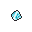
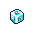
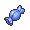

# 사탕 이미지 참고 자료

수집일: 2026-09-21. 설계 참고 자료다. 앱에 탑재한 상태가 아니다.
원본 이미지 URL과 SHA-256은 [수집 목록](manifest.json)에 기록했다.

| 종류 | 수집 이미지 | 출처 |
| --- | --- | --- |
| 경험사탕 XS |  | PokéSprite |
| 경험사탕 S |  | PokéSprite |
| 경험사탕 M |  | PokéSprite |
| 경험사탕 L |  | PokéSprite |
| 경험사탕 XL |  | PokéSprite |
| 이상한사탕 |  | PokeAPI/sprites |

[PokéSprite](https://github.com/msikma/pokesprite)는 아이템 이미지와 식별자 매핑을 제공한다. [이미지 목록](https://msikma.github.io/pokesprite/overview/inventory.html)에서 종류별 이미지를 확인할 수 있다.
[PokéAPI](https://pokeapi.co/docs/v2)는 도구 이름과 설명 등의 데이터를 제공한다. 이번에 받은 [XS API 응답](exp-candy-xs.json)의 `sprites.default`는 `null`이다. XS 이미지는 PokéSprite에서 별도로 수집했다.

PokéSprite의 소프트웨어 라이선스는 [MIT](https://github.com/msikma/pokesprite/blob/master/license.md)다. 원작 이미지 권리까지 자유 이용으로 확정하지 않는다. [PokeAPI 이미지 라이선스](https://github.com/PokeAPI/sprites/blob/master/LICENCE.txt)는 저장소의 CC0 표기와 별도로 모든 이미지의 저작권을 The Pokémon Company로 명시한다.

사탕 종류는 사용자 결정이다. 원본 데이터의 가격과 효과량은 이 게임의 밸런스 결정이 아니다. [설계 기록](../../plan.md#경험사탕-5종과-이상한사탕-및-이미지-조사)을 따른다.
