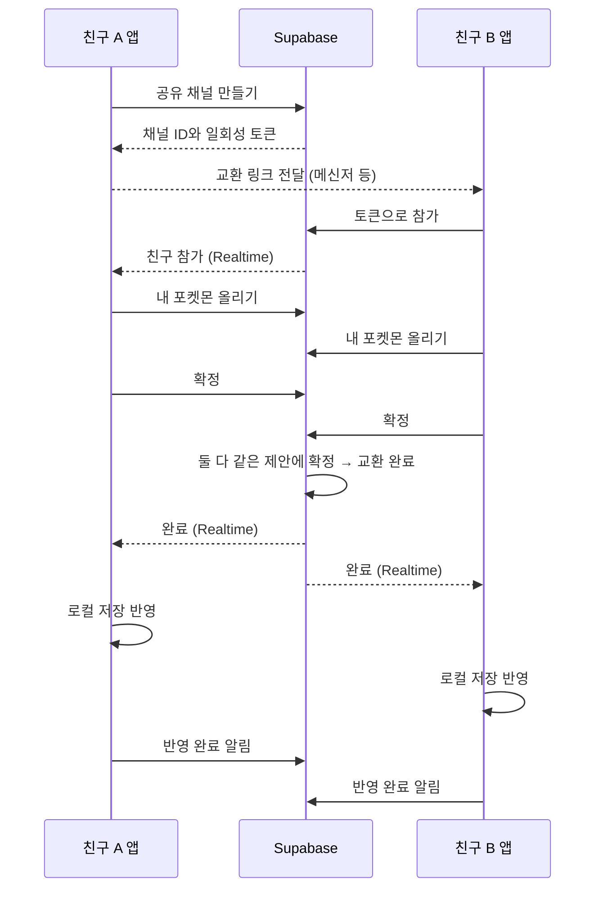

# 친구 교환 기록

친구끼리 포켓몬을 한 마리씩 맞바꾸는 교환 기능의 기록이다. 서버는 Supabase를 쓴다.
상태: 설계 진행 중. 구현 미시작. 번호의 뜻은 [번호 체계](../../terms.md#번호-체계)를 따른다.

## 설계

### 출처와 사용자 결정

2026-09-26 대화에서 정했다. 아래 표는 사용자 발언과 선택만 적는다.

| 항목 | 사용자 결정 | 출처 |
|---|---|---|
| 서버 | Supabase를 DB 겸 서버로 쓰는 방향을 제안했다. 설계 진행에 동의했다. | "supabase기반으로 db겸 서버 운영하는거 어때?", "기록도 남기고 좀 더 탄탄하게 설계 진행해보자" |
| 확장 방향 | 소셜 로그인, 교환, 나중의 배틀을 언급했다. | 첫 발언 |
| 교환 상대 | 친구끼리만 한다. URL을 보냈을 때만 교환한다. 공유 채널은 일회성이다. | "교환은 친구끼리만 공유채널같은거 url보내면 그때만 되는 느낌으로 말이야. 일회성 공유채널" |
| 로그인 | 교환에는 로그인이 필요 없다. | 선택지 "로그인 없이" |
| 단일 포켓몬 | 교환할 수 없다. | 선택지 "교환 불가" |
| 첫 선택 포켓몬 | 교환 제한이 없다. | "제한은 없이하고, 두번째파티칸 업적을 최초로 포켓몬 50레벨 달성으로 변경." |
| 두 번째 파티 칸 업적 | 조건을 "최초로 포켓몬 50레벨 달성"으로 바꾼다. 첫 포켓몬 최종 진화 조건을 대체한다. | 같은 발언 |
| 교환 진화 | `유대의끈` 규칙을 유지한다. 교환해도 진화하지 않는다. | 선택지 "유대의끈 유지" |
| 50레벨 업적 판정 | 받은 개체 자체는 인정하지 않는다. 이 저장에서 처음으로 50레벨 이상으로 레벨업해야 달성한다. 표기는 "최초로 50레벨 포켓몬 달성"이다. | "받은거자체는 인정안되고, 최초로 50레벨 이상 레벨업해야 클리어되게. 표기자체는 최초로 50레벨 포켓몬 달성으로 하고." |
| 교환 화면 위치 | 관리 창의 `가방` 탭 옆에 둔다. | "가방 옆에 해도 될듯." |
| 패키지 | `@supabase/supabase-js` 추가를 승인했다. | "패키지 추가해" |
| 로그인 범위 (2026-09-27) | 소셜 로그인과 일반 로그인을 함께 설계한다. | "소셜로그인도 같이 설계해. 일반 id, pw 로그인도 해봐." |
| 본인인증 (2026-09-27) | 본인인증은 하지 않는다. | "본인인증은 굳이 필요없지 않나 싶은데" |
| 일반 로그인 아이디 (2026-09-27) | 처음에는 이메일 + 비밀번호를 골랐다. 같은 날 정정: 이메일은 빼고 아이디 + 비밀번호로 한다. 아이디는 중복검사를 한다. | 선택지 "이메일 + 비밀번호", 정정 "이메일은 빼고 id 로그인해. 중복검사하고." |
| 아이디 글자 (2026-09-27) | 아이디는 영어만 받는다. | "id는 영어만" |
| 이름 (2026-09-27) | 가입할 때 이름도 받는다. | "이름도 받게 추가하고" |
| 소셜 로그인 (2026-09-27) | 처음에는 Google과 GitHub를 골랐다. 같은 날 정정: Google은 일단 빼고 GitHub만 둔다. | 선택지 "Google, GitHub", 정정 "구글도 빼자 일단은" |

### 목표

- 친구 두 명이 링크 하나로 포켓몬을 한 마리씩 맞바꾼다.
- 교환이 끝나면 공유 채널을 닫는다. 같은 링크를 다시 쓸 수 없다.
- 교환 도중에 앱이 꺼져도 개체가 사라지거나 복제되지 않는다.
- 서버에 연결하지 못해도 교환 밖의 게임은 그대로 돈다.

### 범위에서 제외

- 배틀. 배틀 규칙이 아직 없다.
- 클라우드 백업. 계정 위에 나중에 설계한다. 2026-09-27 정정: 소셜 로그인과 이메일 로그인은 범위에 넣었다. [계정과 로그인](#계정과-로그인)을 따른다.
- 모르는 사람과의 교환, 공개 거래소, 친구 목록, 채팅.
- 여러 마리 동시 교환. 알·도구·포인트 교환.

### 관련 기준

| 기준 | 연결 |
|---|---|
| 개체 필드 | [저장 v3 타입](../../../src/shared/save-v3.ts) `PetV3` |
| 거래 원칙 | [모듈 계약 거래 실행기](../../specs/modules.md#거래-실행기) |
| 단일 포켓몬 | [용어사전](../../terms.md#포켓몬과-파티)의 `단일 포켓몬`, [단일 포켓몬 판정](../../../src/dex/forms.ts) |
| 교환 진화 | [S5 진화 조건 대체표](../../specs/s5.md#4-상세와-진화) 4순위 |
| 두 번째 파티 칸 업적 | [파티 칸 확장과 박스 수용](../../specs/s5.md#파티-칸-확장과-박스-수용), [업적 판정](../../../src/achievement/core.ts) |
| Electron 보안 | [현재 설계](../../design.md)의 preload·contextIsolation·sandbox·IPC 검사 |

### 전체 구조

`[스펙 미확정]` 아래는 제안이다. 사용자 결정 표의 항목만 확정이다.



서버는 교환의 심판만 맡는다. 서버는 개체를 계속 보관하지 않는다. 게임 상태의 정본은 계속 각자의 `save.json`이다.

### 공유 채널

`[스펙 미확정]` 제안이다.

| 항목 | 제안 |
|---|---|
| 토큰 | 128비트 무작위 값을 base64url로 쓴다. 서버는 SHA-256 해시만 저장한다. |
| 참가 인원 | 만든 사람과 참가한 사람 두 명이다. 두 번째 사람이 참가하면 토큰을 무효로 한다. |
| 자기 참가 | 만든 사람은 자기 링크로 참가할 수 없다. |
| 참가 전 만료 | 만든 뒤 10분 안에 아무도 참가하지 않으면 채널을 닫는다. |
| 참가 후 만료 | 참가 뒤 30분 동안 교환이 끝나지 않으면 채널을 닫는다. |
| 취소 | 어느 쪽이든 확정 전에는 나갈 수 있다. 나가면 채널을 닫는다. |
| 상태 | `open` → `joined` → `done`. 중간에 `cancelled` 또는 `expired`로 끝날 수 있다. |

### 교환 링크

`[스펙 미확정]` 제안이다.

- 링크 모양은 `https://<정적 페이지>/trade#<토큰>`이다. 토큰을 `#` 뒤에 두면 페이지 서버 기록에 남지 않는다.
- 정적 페이지는 `pokebuddy://trade/<토큰>`으로 앱을 연다. 앱이 열리지 않으면 링크 복사 안내를 보인다.
- 메신저는 `pokebuddy://` 링크를 누를 수 있게 표시하지 않을 때가 많다. 그래서 https 링크를 기본으로 보낸다.
- 앱의 교환 화면에 링크 붙여넣기 칸을 둔다. 딥링크가 실패해도 이 칸으로 참가할 수 있다.
- 정적 페이지는 GitHub Pages에 둔다. Supabase는 정적 페이지를 호스팅하지 않는다.
- `pokebuddy trade <링크>` CLI 명령을 둔다. 기존 CLI와 mailbox 경로로 실행 중인 앱에 전달한다.

Electron 처리 제안:

- `app.setAsDefaultProtocolClient('pokebuddy')`로 프로토콜을 등록한다.
- Windows에서는 두 번째 실행의 인자로 링크가 들어온다. 이미 실행 중인 앱에 전달한다.
- macOS에서는 `open-url` 이벤트로 링크가 들어온다.
- 설치 파일이 프로토콜을 등록한다. 개발 실행에서는 붙여넣기 칸으로 확인한다.

### 교환 규칙

| 규칙 | 확정 여부 |
|---|---|
| 한 번에 한 마리씩 맞바꾼다. | `[스펙 미확정]` 제안 |
| 파티 개체와 박스 개체 모두 올릴 수 있다. | `[스펙 미확정]` 제안 |
| 단일 포켓몬은 올릴 수 없다. 공유 `sid` 계열도 단일 포켓몬 판정을 따른다. | 사용자 결정 2026-09-26 |
| 첫 선택 포켓몬도 올릴 수 있다. | 사용자 결정 2026-09-26 |
| 받은 개체는 보낸 개체가 있던 자리에 들어간다. 파티 칸이면 그 칸의 숨김 상태를 유지한다. | `[스펙 미확정]` 제안 |
| 교환해도 진화하지 않는다. 교환 진화 종은 `유대의끈`으로 진화한다. | 사용자 결정 2026-09-26 |
| 어느 쪽이든 올린 포켓몬을 바꾸면 양쪽의 확정을 푼다. | `[스펙 미확정]` 제안 |
| 두 사람이 같은 제안 판에 확정해야 교환한다. | `[스펙 미확정]` 제안 |

받은 개체가 보낸 자리에 들어가므로 보유 개체 수와 파티 칸 수가 바뀌지 않는다. 그래서 파티가 비는 경우가 없다.

### 개체에서 옮기는 값

`[스펙 미확정]` 제안이다. 기준 필드는 `PetV3`다.

| 구분 | 필드 | 받는 쪽 처리 |
|---|---|---|
| 그대로 옮긴다 | `species`, `shiny`, `nature`, `size`, `level`, `exp`, `affinity`, `fullness`, `mood`, `stage`, `evolved`, `forms` | 받은 값을 쓴다 |
| 새로 정한다 | `id` | 받는 저장의 `nextPetId` 값을 쓴다 |
| 새로 정한다 | `since` | 받은 시각을 쓴다 |
| 처음 값으로 둔다 | `affinityProgressMs`, `fullnessProgressMs`, `moodProgressMs`, `feedCooldownMs`, `playCooldownMs`, `playWindowMs`, `playStreak` | 0 |
| 처음 값으로 둔다 | `buffs` | 빈 배열. 남은 버프는 옮기지 않는다 |
| 처음 값으로 둔다 | `home`, `daily` | `newPet`과 같은 시작 값 |

받는 쪽은 `recordDex`로 도감에 획득과 이로치를 기록한다. 교환으로 받은 종은 해금 조건 없이 도감에 등록된다. 친구 사이의 교환이므로 이것을 허용한다.

### 검사

서버는 채널 상태와 순서만 검사한다. 개체 값의 검사는 각 앱의 메인 프로세스가 한다.

올릴 때 내 앱이 검사한다.

- 내가 가진 개체인가?
- 단일 포켓몬이 아닌가?
- 다른 교환에 걸려 있지 않은가?

친구의 제안을 받을 때 내 앱이 검사한다. 하나라도 실패하면 확정 단추를 끄고 이유를 보인다.

- 내 데이터에 있는 종인가? `evolved`와 `forms`의 종도 확인한다.
- 단일 포켓몬이 아닌가? 조작한 앱이 올려도 받는 쪽에서 막는다.
- `level`은 1~100, `affinity`·`fullness`·`mood`는 0~100, `size`는 1~6인가?
- `nature`가 25개 성격 중 하나인가?

친구끼리의 교환이므로 조작을 완전히 막지 않는다. 위 검사는 깨진 값과 규칙 밖 개체를 거르는 용도다.

### 서버 설계

`[스펙 미확정]` 이 절 전체가 제안이다. 2026-09-27 구현 직전 수준으로 보강했다. 코드·SQL 파일·Supabase 프로젝트는 만들지 않았다.
Supabase 동작은 2026-09-27 공식 문서(Context7 `/supabase/supabase`)에서 확인했다. 확인한 항목은 익명 로그인, Realtime 비공개 Broadcast와 `realtime.messages` RLS, `realtime.send`, 무료 요금제 정지다.

#### 원칙

- 서버는 교환의 순서만 판정한다. 개체 값의 정본은 각자의 `save.json`이다.
- 앱은 테이블을 직접 읽거나 쓰지 않는다. 모든 동작은 Postgres 함수(RPC)로만 한다.
- 실시간 알림은 신호만 보낸다. 앱은 신호를 받으면 `get_channel`로 상태를 다시 읽는다. 알림을 놓쳐도 상태가 어긋나지 않는다.
- 시각은 DB의 `now()` 하나로 판정한다. 앱의 남은 시간 표시는 `expires_at`을 보여 주기만 한다.

#### 프로젝트 구성

| 항목 | 제안 |
|---|---|
| 프로젝트 | Supabase 프로젝트 하나. 지역은 서울(`ap-northeast-2`) |
| 요금제 | 무료. 7일 동안 활동이 없으면 멈춘다. 멈추면 앱은 `연결 실패`를 보인다. 2026-09-27 사용자가 대안을 고르지 않아 기본안 A로 둔다 |
| 인증 | 익명 로그인(`signInAnonymously`)만 켠다. 이메일·소셜 로그인은 끈다 |
| 앱에 넣는 값 | 프로젝트 URL과 공개 키(publishable 키, 옛 이름 anon 키). 공개해도 되는 값이다 |
| 앱에 넣지 않는 값 | service role 키, DB 비밀번호. 저장소에도 넣지 않는다 |
| 설정 파일 | `data/online.json`에 `url`, `publishableKey`, `protocol`을 둔다. 개발 중에는 환경 변수로 로컬 주소를 덮어쓴다 |
| 확장 | `pgcrypto`(토큰 해시), `pg_cron`(정리) |

익명 사용자는 `authenticated` 역할을 쓴다. JWT의 `is_anonymous`가 `true`다. 이 설계는 익명 사용자만 쓰므로 정책에서 익명 여부를 나누지 않는다.
익명 세션은 메인 프로세스가 저장한다. `supabase-js`의 저장소 어댑터를 `safeStorage` 암호화 파일로 바꾼다. 세션 파일을 잃으면 새 익명 사용자가 된다. 그러면 진행 중인 채널을 다시 찾을 수 없다. 이 경우의 처리는 [로컬 저장과 복구](#로컬-저장과-복구)의 `채널 없음`을 따른다.

#### 테이블

```sql
create type public.trade_status as enum ('open', 'joined', 'done', 'cancelled', 'expired');

create table public.trade_channels (
  id               uuid primary key default gen_random_uuid(),
  token_hash       bytea not null unique,          -- 토큰의 SHA-256. 원문은 저장하지 않는다
  host             uuid references auth.users(id) on delete set null,  -- 계정 삭제 뒤에도 상대의 반영을 위해 남긴다
  guest            uuid references auth.users(id) on delete set null,
  status           public.trade_status not null default 'open',
  protocol         int not null,
  data_version     text not null,
  host_offer       jsonb,
  guest_offer      jsonb,
  offer_rev        int not null default 0,         -- 어느 쪽 제안이든 바뀌면 1 올린다
  host_ready_rev   int,                            -- 확정한 offer_rev. null 이면 미확정
  guest_ready_rev  int,
  closed_reason    text,                           -- host_left · guest_left · expired
  created_at       timestamptz not null default now(),
  expires_at       timestamptz not null,
  joined_at        timestamptz,
  done_at          timestamptz,
  host_applied_at  timestamptz,
  guest_applied_at timestamptz,
  check (guest is null or guest <> host)
);

create index on public.trade_channels (host, status);
create index on public.trade_channels (guest, status);
create index on public.trade_channels (expires_at) where status in ('open', 'joined');

alter table public.trade_channels enable row level security;
-- 정책을 두지 않는다. 앱 역할은 행을 읽거나 쓸 수 없다. 함수만 접근한다
revoke all on public.trade_channels from anon, authenticated;
```

확정은 참·거짓이 아닌 `ready_rev`로 저장한다. 확정은 `ready_rev = offer_rev`일 때만 유효하다. 제안이 바뀌면 `offer_rev`가 올라 기존 확정이 저절로 풀린다. 확정을 지우는 별도 쓰기가 없어서 경합이 줄어든다.
`token_hash`는 참가 뒤에도 남긴다. 같은 링크를 다시 열면 `사용됨`과 `없는 링크`를 구분할 수 있다.

#### 함수

모든 함수는 `security definer`와 `set search_path = ''`로 만든다. `authenticated` 역할에만 실행 권한을 준다. 먼저 `auth.uid()`가 있는지 확인한다.
채널을 바꾸는 함수는 `select … for update`로 행을 잠근 뒤 검사한다. 그래서 한 채널의 동작은 한 번에 하나씩 처리된다.
실패는 `raise exception`의 메시지에 아래 오류 코드를 넣어 알린다.

| 함수 | 입력 → 출력 | 검사 순서와 동작 |
|---|---|---|
| `create_channel` | `protocol`, `data_version` → `channel_id`, `token`, `expires_at` | ① 지원하는 `protocol`인지 확인한다. ② 최근 1시간에 만든 채널이 20개 이상이면 `TRADE_RATE_LIMITED`. ③ 내가 `joined` 채널에 있으면 `TRADE_ALREADY_ACTIVE`. ④ 내가 만든 `open` 채널이 있으면 `cancelled`로 닫는다. ⑤ 16바이트 무작위 토큰을 만든다. ⑥ 해시를 저장하고 `expires_at = now() + 10분`으로 둔다 |
| `join_channel` | `token`, `protocol`, `data_version` → `channel_id` | ① 해시로 행을 찾아 잠근다. 없으면 `TRADE_LINK_INVALID`. ② 시간이 지난 `open`이면 `expired`로 바꾸고 `TRADE_LINK_EXPIRED`. ③ `joined`·`done`이면 `TRADE_LINK_USED`. ④ `cancelled`·`expired`면 `TRADE_LINK_EXPIRED`. ⑤ 만든 사람이 나면 `TRADE_OWN_LINK`. ⑥ 규약·데이터 버전이 다르면 `TRADE_VERSION_MISMATCH`. ⑦ 내가 다른 `joined` 채널에 있으면 `TRADE_ALREADY_ACTIVE`. ⑧ 내가 만든 `open` 채널이 있으면 닫는다. ⑨ `guest`, `joined`, `joined_at`을 쓰고 `expires_at = now() + 30분`으로 바꾼다 |
| `set_offer` | `channel_id`, `pet` → `offer_rev` | ① 참가자가 아니면 `TRADE_NOT_FOUND`. ② 시간이 지났으면 `expired`로 바꾸고 `TRADE_CLOSED`. ③ `joined`가 아니면 `TRADE_CLOSED`. ④ `pet`이 4KB를 넘거나 필수 필드가 없으면 `TRADE_OFFER_INVALID`. ⑤ 내 제안을 쓰고 `offer_rev`를 1 올린다 |
| `set_ready` | `channel_id`, `rev`(null이면 확정 취소) → `status` | ①~③은 `set_offer`와 같다. ④ 양쪽 제안이 모두 있어야 한다(`TRADE_OFFER_MISSING`). ⑤ `rev`가 현재 `offer_rev`와 다르면 `TRADE_OFFER_CHANGED`. ⑥ 내 `ready_rev`를 쓴다. ⑦ 상대의 `ready_rev`도 `offer_rev`와 같으면 `done`과 `done_at`을 쓴다 |
| `cancel_channel` | `channel_id` → `status` | `open`·`joined`면 `cancelled`와 `host_left`·`guest_left`를 쓴다. 이미 `done`이면 `TRADE_ALREADY_DONE`. 이미 닫혔으면 그대로 돌려준다 |
| `get_channel` | `channel_id` → 채널 보기 | 시간이 지난 채널은 먼저 `expired`로 바꾼다. 내 역할, 상태, `offer_rev`, 내 제안, 친구 제안, 양쪽 확정 여부, `expires_at`, `closed_reason`을 돌려준다. 토큰 해시와 사용자 ID는 돌려주지 않는다 |
| `ack_applied` | `channel_id` → 없음 | `done`에서만 받는다. 내 `applied_at`을 쓴다. 양쪽이 모두 반영했으면 두 제안 값을 지운다. 같은 요청을 다시 받아도 결과가 같다 |

바꾸는 함수는 끝에서 실시간 신호를 보낸다. [실시간 알림](#실시간-알림)을 따른다.
`set_ready`의 확정 취소(`rev = null`)는 `done` 전에만 된다.

#### 오류 코드와 화면

오류 코드는 [화면](#화면)의 오류 표와 연결한다. 마지막 두 줄은 새 화면 문구가 필요하다. Figma 시안에는 아직 없다.

| 오류 코드 | 화면 |
|---|---|
| `TRADE_LINK_INVALID`, `TRADE_NOT_FOUND` | 만료와 같은 화면. 문구는 "쓸 수 없는 링크" 계열 |
| `TRADE_LINK_EXPIRED`, `TRADE_CLOSED` + `expired` | 만료 |
| `TRADE_LINK_USED` | 사용됨 |
| `TRADE_OWN_LINK` | 자기 링크 |
| `TRADE_VERSION_MISMATCH` | 버전 다름 |
| `TRADE_CLOSED` + `host_left`·`guest_left` | 친구 나감 |
| `TRADE_OFFER_CHANGED`, `TRADE_OFFER_MISSING` | 화면을 바꾸지 않는다. 상태를 다시 읽는다 |
| `TRADE_OFFER_INVALID` | 받을 수 없음과 같은 안내. 내 앱이 먼저 검사하므로 정상 흐름에서는 나오지 않는다 |
| `TRADE_ALREADY_DONE` | 교환 완료로 넘어가 반영한다 |
| 네트워크 실패, 서버 정지 | 연결 실패 |
| `TRADE_RATE_LIMITED` | 새 문구 필요. "잠시 뒤 다시 만들기" 계열 |
| `TRADE_ALREADY_ACTIVE` | 새 문구 필요. 이미 교환 중인 채널이 있다 |

#### 상태 전이

| 지금 상태 | 사건 | 다음 상태 |
|---|---|---|
| `open` | 친구 참가 | `joined` |
| `open` | 만든 사람 취소, 같은 사람의 새 채널, 같은 사람의 다른 링크 참가 | `cancelled` |
| `open` | 10분 지남 | `expired` |
| `joined` | 제안 변경 | `joined` (`offer_rev` + 1) |
| `joined` | 같은 `offer_rev`에 양쪽 확정 | `done` |
| `joined` | 어느 쪽이든 나감 | `cancelled` |
| `joined` | 30분 지남 | `expired` |
| `done` | 양쪽 반영 완료 | `done` (제안 값 삭제) |

`done`·`cancelled`·`expired`는 끝 상태다. 끝 상태에서는 다른 상태로 가지 않는다. `done`은 만료되지 않는다.

#### 동시에 일어나는 경우

한 채널의 모든 쓰기는 행 잠금으로 한 줄로 선다. 아래 경우에도 결과는 하나다.

| 경우 | 결과 |
|---|---|
| 두 사람이 같은 순간에 확정한다 | 먼저 잠근 쪽이 자기 확정만 쓴다. 뒤쪽이 상대 확정을 보고 `done`을 쓴다 |
| A가 확정하는 순간 B가 제안을 바꾼다 | A가 먼저면 B의 변경이 `offer_rev`를 올려 A의 확정이 풀린다. B가 먼저면 A는 `TRADE_OFFER_CHANGED`를 받는다. 어느 쪽이든 바뀐 제안으로 교환되지 않는다 |
| 마지막 확정과 만료가 겹친다 | 확정이 먼저면 `done`이다. `done`은 만료되지 않는다. 만료가 먼저면 확정은 `TRADE_CLOSED`를 받는다 |
| 마지막 확정과 나가기가 겹친다 | 확정이 먼저면 나가기는 `TRADE_ALREADY_DONE`을 받고 앱은 반영한다. 나가기가 먼저면 확정은 `TRADE_CLOSED`를 받는다 |
| `done` 알림이 오기 전에 앱이 꺼진다 | 다시 켜면 `get_channel`이 `done`을 돌려준다. [로컬 저장과 복구](#로컬-저장과-복구)대로 반영한다 |

#### 실시간 알림

Realtime의 비공개 Broadcast를 쓴다. 테이블 변경 구독(`postgres_changes`)은 쓰지 않는다. 테이블에 읽기 정책을 두지 않아도 되고, 보낼 내용을 함수가 정할 수 있기 때문이다.

- 채널 주제는 `trade:<channel_id>`다. 앱은 `private: true`로 구독한다.
- 바꾸는 함수는 끝에서 `realtime.send`로 `changed` 사건을 보낸다. 내용은 `status`와 `offer_rev`뿐이다. 제안 값은 보내지 않는다.
- 앱은 `changed`를 받으면 `get_channel`로 다시 읽는다. 구독을 시작하거나 다시 연결했을 때도 한 번 읽는다.
- 교환 화면이 열려 있는 동안 신호가 30초 넘게 없으면 한 번 다시 읽는다.

```sql
create function public.is_trade_participant(topic text) returns boolean
language sql stable security definer set search_path = '' as $$
  select exists (
    select 1 from public.trade_channels c
    where topic = 'trade:' || c.id::text
      and (select auth.uid()) in (c.host, c.guest)
  );
$$;

create policy "trade participants receive"
on realtime.messages for select to authenticated
using (realtime.messages.extension = 'broadcast'
       and public.is_trade_participant((select realtime.topic())));
-- insert 정책을 두지 않는다. 앱은 이 주제에 메시지를 보낼 수 없다
```

#### 정리와 남용 방지

`pg_cron` 작업 두 개를 둔다.

| 작업 | 주기 | 동작 |
|---|---|---|
| 만료 | 5분 | 시간이 지난 `open`·`joined`를 `expired`로 바꾼다. 함수에서도 같은 판정을 하므로 이 작업은 늦어도 된다 |
| 삭제 | 1일 | 끝난 지 1일 지난 `cancelled`·`expired`를 지운다. 양쪽이 반영하고 1일 지난 `done`을 지운다. 반영하지 않은 `done`은 30일 뒤에 지운다. 채널이 없고 90일 동안 로그인하지 않은 익명 사용자를 지운다 |

남용 방지는 세 가지다.

- 사용자당 채널 생성은 1시간에 20개까지다.
- 사용자는 동시에 채널 하나만 쓴다.
- 익명 로그인은 Supabase의 IP별 제한을 그대로 쓴다. 데스크톱 앱이라 CAPTCHA는 두지 않는다.

#### 개발과 검사

- 로컬 Supabase를 Docker로 띄운다. 이 PC에 Docker가 있다(2026-09-27 확인). Supabase CLI는 없다. CLI 설치는 구현할 때 사용자 승인을 받는다.
- 저장소에 `supabase/config.toml`과 `supabase/migrations/<시각>_trade.sql`을 둔다. `config.toml`에서 `enable_anonymous_sign_ins = true`로 둔다.
- 함수 검사는 pgTAP(`supabase test db`)으로 한다. 상태 전이 표와 동시에 일어나는 경우 표의 모든 줄을 검사한다.
- 앱 E2E는 임시 HOME 두 개로 앱 두 개를 띄운다. 두 앱을 로컬 Supabase에 연결해 수용 조건 1~8을 확인한다.
- 실제 프로젝트에는 같은 마이그레이션을 `supabase db push`로 올린다. 프로젝트 생성과 키 발급은 사용자가 한다.

#### 버전 값

- `protocol`은 교환 규약 번호다. 처음 값은 1이다. 함수 입력이나 개체 값 형식이 바뀌면 올린다. 서버는 지원하는 범위를 함수 안에 상수로 둔다.
- `data_version`은 종 데이터의 지문이다. 빌드할 때 `data/`의 종 ID 목록을 정렬해 SHA-256 앞 12자리를 만든다. 두 앱의 값이 다르면 참가를 거절한다.

### 계정과 로그인

2026-09-27 사용자 지시로 추가했다. 같은 날 로그인 방법을 아이디+비밀번호와 GitHub로 정정했다. 출처는 [출처와 사용자 결정](#출처와-사용자-결정)의 2026-09-27 행이다. 사용자 결정 외의 내용은 `[스펙 미확정]` 제안이다.
Supabase 동작은 2026-09-27 공식 문서(Context7 `/supabase/supabase`)에서 확인했다. 확인한 항목은 익명 사용자의 이메일 연결 조건, `linkIdentity`, PKCE OAuth 흐름이다.

#### 목적과 범위

- 로그인은 선택 기능이다. 로그인하지 않아도 교환은 익명 계정으로 된다. 2026-09-26 결정 "교환에는 로그인이 필요 없다"를 유지한다.
- 로그인 방법은 아이디+비밀번호와 GitHub 두 가지다. 이메일 로그인과 Google은 넣지 않는다(2026-09-27 사용자 결정).
- 본인인증(휴대폰·실명 확인)은 하지 않는다. 이메일을 받지 않으므로 확인 메일도 없다.
- 로그인하면 기기를 바꾸거나 앱을 다시 설치해도 같은 계정을 쓴다. 지금 계정에 붙는 서버 데이터는 교환 채널뿐이다. 클라우드 백업은 이 계정 위에 나중에 설계한다.
- 로그인은 게임 저장(`save.json`)을 바꾸지 않는다. 로그아웃해도 게임 진행은 그대로다.
- 앱을 가볍게 유지한다. 메일 발송 서비스, 비밀번호 재설정 화면, 외부 동의 화면 심사가 필요한 방법은 넣지 않는다.

#### 익명 계정과 정식 계정

Supabase는 익명 사용자에 이메일이나 소셜 계정을 연결해 같은 사용자 ID를 유지할 수 있다. 그런데 익명 사용자에 비밀번호를 붙이려면 이메일 확인이 먼저 필요하다. 이 설계는 이메일을 받지 않는다.
그래서 익명 계정을 바꾸지 않는다. 로그인하면 정식 계정으로 세션을 바꾼다. 남은 익명 사용자는 정리 작업이 지운다.

이 방식이 안전하려면 세션을 바꿀 때 걸린 교환이 없어야 한다.

- 내 채널이 `open`·`joined`이거나 로컬 `trade.pending`이 있으면 로그인·가입·로그아웃·계정 삭제를 막는다. 화면은 "교환을 끝낸 뒤 다시 시도" 계열 문구를 보인다.
- 반영하지 않은 `done` 채널이 있으면 먼저 반영한 뒤 세션을 바꾼다.

#### 아이디와 비밀번호

Supabase의 비밀번호 로그인은 이메일이나 전화번호가 있어야 한다. 그래서 아이디를 내부 이메일로 바꿔 쓴다. 사용자는 이 주소를 보지 않는다.

| 항목 | 제안 |
|---|---|
| 내부 주소 | `<아이디>@id.pokebuddy.invalid`. `.invalid`는 메일이 갈 수 없는 예약 도메인이다 |
| 아이디 규칙 | 영문 소문자·숫자·밑줄(`_`), 4~16자, 영문으로 시작. 대문자로 입력해도 소문자로 저장한다. 영어만 받는다(2026-09-27 사용자 결정) |
| 이름 | 가입할 때 받는다(2026-09-27 사용자 결정). 화면에 보이는 이름이다. 한글을 쓸 수 있다. 앞뒤 공백을 지우고 1~12자로 받는다. 줄바꿈과 제어 문자는 받지 않는다. 다른 사람과 같아도 된다. `signUp`의 `options.data.display_name`으로 Supabase 사용자 정보에 저장한다. 별도 테이블을 두지 않는다 |
| 예약 아이디 | `admin`, `pokebuddy`, `support`, `system` 같은 이름은 가입할 수 없다. 목록은 서버 함수에 둔다 |
| 비밀번호 규칙 | 8자 이상. Supabase 프로젝트 설정으로 강제한다 |
| 가입 | `signUp({ email: 내부 주소, password })`. 프로젝트의 이메일 확인(Confirm email)을 끈다. 가입하면 바로 로그인된다 |
| 로그인 | `signInWithPassword({ email: 내부 주소, password })` |
| 비밀번호 찾기 | 없다. 잊으면 그 아이디로 다시 로그인할 수 없다. 가입 화면에 이 사실을 한 줄로 보인다 |
| 무차별 대입 | Supabase 인증 서버의 로그인 횟수 제한을 쓴다 |

중복검사는 두 단계다.

1. 입력 중 확인: 아이디 칸에서 입력을 멈추고 0.5초가 지나면 `is_username_available(username)` 함수를 부른다. 결과를 칸 아래에 `사용할 수 있는 아이디` 또는 `이미 쓰는 아이디`로 보인다. 규칙에 맞지 않으면 함수를 부르지 않고 규칙 안내를 보인다.
2. 가입할 때 확인: 입력 중 확인 뒤에 다른 사람이 먼저 가입할 수 있다. 그래서 `signUp`의 "이미 가입한 사용자" 오류도 `이미 쓰는 아이디`로 보인다. 최종 판정은 이 단계다.

```sql
create function public.is_username_available(username text) returns boolean
language plpgsql stable security definer set search_path = '' as $$
declare
  name text := lower(username);
begin
  if name !~ '^[a-z][a-z0-9_]{3,15}$' then
    raise exception 'AUTH_USERNAME_INVALID';
  end if;
  if name = any (array['admin', 'pokebuddy', 'support', 'system']) then
    return false;
  end if;
  return not exists (
    select 1 from auth.users u
    where u.email = name || '@id.pokebuddy.invalid'
  );
end;
$$;
-- 익명 세션이 있는 앱이 부르므로 authenticated 에 실행 권한을 준다. 로그인 전 앱도 익명 세션을 먼저 만든다
```

- 이 함수로 어떤 아이디가 있는지 알 수 있다. 아이디 가입 서비스에서 흔한 공개 범위이므로 받아들인다.
- 예약 아이디는 가입 때도 막아야 한다. 가입 요청은 Supabase 인증 서버로 바로 가므로 함수 검사를 거치지 않는다. 그래서 `auth.users`에 넣기 전에 도는 Auth Hook(가입 전 검사) 또는 DB 트리거로 규칙과 예약어를 다시 검사한다. 방식은 구현 때 정한다. `[스펙 미확정]`

#### GitHub 로그인

데스크톱 앱은 PKCE 흐름을 쓴다.

1. 메인 프로세스가 `127.0.0.1`의 고정 포트에 임시 HTTP 서버를 연다.
2. `signInWithOAuth({ provider: 'github', options: { redirectTo, skipBrowserRedirect: true } })`로 로그인 주소를 받는다.
3. `shell.openExternal`로 기본 브라우저를 연다. 사용자는 브라우저에서 GitHub에 로그인한다.
4. 브라우저가 `http://127.0.0.1:<포트>/auth/callback?code=…`로 돌아온다. 임시 서버가 코드를 받는다.
5. `exchangeCodeForSession(code)`로 세션을 만든다. 브라우저에는 "앱으로 돌아가세요" 페이지를 보인다.
6. 임시 서버를 닫는다. 5분 안에 돌아오지 않으면 취소로 본다.

- 포트는 고정값 하나와 예비 두 개를 쓴다. 세 주소를 모두 Supabase의 리디렉션 허용 목록에 넣는다. 포트 번호는 로컬 Supabase의 기본 포트(54321~54324)와 겹치지 않게 정한다.
- 교환 링크처럼 `pokebuddy://` 딥링크를 쓰지 않는다. 개발 실행에서도 되고, 다른 앱이 같은 주소를 가로챌 수 없기 때문이다.
- 사용자가 할 일: GitHub 설정에서 OAuth App을 만든다. 이름, 홈페이지 주소, 콜백 주소 `https://<프로젝트>.supabase.co/auth/v1/callback`을 넣는다. 받은 ID와 비밀 값을 Supabase 대시보드에 넣는다. 검토 절차는 없다.
- 요청 범위는 기본 프로필과 이메일이다. 저장하는 값은 Supabase가 `auth.users`에 두는 값뿐이다. 앱 테이블에 이름·사진을 따로 두지 않는다.
- 아이디 계정과 GitHub 계정은 서로 다른 계정이다. 둘을 연결하는 기능은 넣지 않는다. `[스펙 미확정]` 비밀번호를 잊은 사용자를 위해 아이디 계정에 GitHub를 연결하는 기능(`linkIdentity`)은 나중에 필요하면 설계한다.

#### 로그아웃과 계정 삭제

| 동작 | 제안 |
|---|---|
| 로그아웃 | 세션을 지운다. 다음에 교환을 열면 새 익명 계정을 만든다 |
| 계정 삭제 | 설정 화면에서 한다. 서비스 역할 키가 필요하므로 Edge Function `delete-account`가 처리한다. 함수는 요청한 사용자의 JWT로 본인을 확인한 뒤 `auth.admin.deleteUser`를 호출한다. 삭제한 아이디는 다시 가입할 수 있다 |
| 삭제와 교환 기록 | 채널의 `host`·`guest` 외래 키를 `on delete set null`로 둔다. 상대가 아직 반영하지 않은 `done` 채널을 남기기 위해서다 |

#### 세션 저장

- 익명 세션과 정식 세션은 같은 곳에 저장한다. 메인 프로세스의 `safeStorage` 암호화 파일이다.
- 렌더러에는 로그인 상태, 로그인 방법, 이름, 아이디만 넘긴다. GitHub 계정의 이름은 GitHub 프로필 이름을 처음 값으로 쓴다. 토큰과 내부 주소는 넘기지 않는다.
- 여러 PC에서 같은 계정으로 로그인할 수 있다. 채널 하나만 쓰는 규칙은 계정 단위이므로 두 PC가 동시에 교환하지 못한다.

#### 화면

`[스펙 미확정]` 화면은 Figma 시안을 확인한 뒤 코드로 만든다. 시안은 아직 요청하지 않았다.

- 설정 모달에 `계정` 행을 둔다. 로그인 전에는 `로그인`, 로그인 뒤에는 아이디 또는 GitHub 이름을 보인다.
- 계정 화면은 가이드북처럼 설정 모달 안에서 바뀌고 `‹ 설정`으로 돌아간다.
- 로그인 화면: `GitHub로 계속`, 아이디·비밀번호 칸, `로그인`, `가입`으로 가는 버튼.
- 가입 화면: 아이디 칸과 중복검사 결과, 이름 칸, 비밀번호 칸, 비밀번호 확인 칸, "비밀번호를 잊으면 찾을 수 없어요" 한 줄, `가입`.
- 로그인 뒤: 이름과 아이디, `이름 바꾸기`, `로그아웃`, `계정 삭제`(확인 대화상자). 이름 바꾸기는 `updateUser({ data: { display_name } })`로 한다.
- 교환 중이라 막힌 상태의 안내.

#### 오류

| 상황 | 화면 |
|---|---|
| 아이디 또는 비밀번호가 틀림 | 로그인 칸 아래 안내. 어느 쪽이 틀렸는지 나누지 않는다 |
| 아이디 규칙 미달 (`AUTH_USERNAME_INVALID`) | 아이디 칸 아래 규칙 안내 |
| 이미 쓰는 아이디 | 아이디 칸 아래 안내 |
| 비밀번호 규칙 미달, 확인 불일치 | 비밀번호 칸 아래 안내 |
| 이름이 비었거나 12자를 넘음 | 이름 칸 아래 안내 |
| 브라우저 로그인을 5분 안에 끝내지 않음 | 조용히 로그인 화면으로 돌아간다 |
| 교환이 걸려 있음 | 막힌 상태 안내 |
| 연결 실패 | 교환과 같은 연결 실패 안내 |

#### 위험

| 위험 | 대응 |
|---|---|
| 비밀번호 분실 | 찾을 방법이 없다. 가입 화면에서 미리 알린다 |
| 아이디 노출 | 중복검사 함수로 아이디의 존재를 알 수 있다. 흔한 공개 범위로 보고 받아들인다 |
| 예약 아이디 우회 | 가입 요청이 함수 검사를 거치지 않는다. 가입 전 검사(Auth Hook 또는 트리거)로 막는다 |
| 개인정보 | 아이디 계정은 개인정보를 받지 않는다. GitHub 로그인은 GitHub의 기본 프로필과 이메일이 `auth.users`에 남는다. 공개 배포 전에 처리 안내를 준비한다 |
| 세션 전환 중 교환 | 걸린 교환이 있으면 세션 전환을 막는다 |

#### 수용 조건 (구현할 때 검사한다)

1. 로그인하지 않아도 교환이 된다.
2. 아이디 칸에 입력하면 중복 여부가 칸 아래에 보인다. 규칙 밖 아이디는 함수를 부르지 않는다.
3. 두 앱이 같은 아이디로 거의 동시에 가입하면 하나만 성공한다. 나머지는 `이미 쓰는 아이디`를 보인다.
4. 예약 아이디는 화면과 가입 요청 모두에서 막힌다.
5. 아이디로 가입하면 바로 로그인된다. 다른 PC에서 같은 아이디로 로그인한다.
6. GitHub 로그인 뒤 브라우저에서 앱으로 돌아와 로그인 상태가 된다.
7. 교환이 걸려 있으면 로그인·가입·로그아웃·계정 삭제가 막힌다.
8. 계정을 삭제해도 상대의 반영하지 않은 교환은 반영된다.
9. 렌더러와 저장소에 토큰, 내부 주소, 서비스 역할 키가 없다.
10. 가입할 때 받은 이름이 계정 화면에 보인다. 이름을 바꾸면 다른 PC에서도 바뀐 이름이 보인다.

`[스펙 미확정]` 교환 화면은 지금 상대를 `친구`로 보인다. 상대가 로그인했으면 그 이름을 보이는 안을 제안한다. 이 경우 `get_channel`이 상대의 `display_name`을 함께 돌려준다.

### 로컬 저장과 복구

`[스펙 미확정]` 제안이다. 거래 실행기의 원칙을 그대로 쓴다.

저장 v3에 선택 영역 `trade`를 더한다. 없으면 빈 값으로 정규화한다. 저장 형식 번호는 올리지 않는다.

```ts
trade?: {
  pending: {
    channelId: string;
    petId: string; // 내가 올린 개체
    offerRev: number; // 내가 확정한 제안 판
    received: TradePet | null; // 완료 뒤 받은 개체 값
  } | null;
};
```

1. 확정할 때 로컬 거래 `trade.lock`이 `pending`을 기록한다. 걸린 개체에는 진화·사탕·민트·박스 이동 명령을 거절한다. 돌봄과 숨기기는 막지 않는다.
2. 서버가 `done`을 알리면 로컬 거래 `trade.apply`가 한 번의 저장으로 개체를 맞바꾸고 `pending`을 지운다.
3. `pending`이 없으면 `trade.apply`는 아무것도 하지 않는다. 그래서 같은 완료를 두 번 받아도 한 번만 반영한다.
4. 반영한 뒤 `ack_applied`를 보낸다. 실패해도 로컬 반영은 되돌리지 않는다. 다음 실행에 다시 보낸다.
5. 교환이 취소·만료되면 `pending`을 지우고 개체를 풀어 준다.

앱을 다시 켰을 때 `pending`이 있으면 `get_channel`로 확인한다.

| 서버 응답 | 처리 |
|---|---|
| `done` | `trade.apply`로 반영한다 |
| `cancelled` 또는 `expired` | 개체를 풀어 준다 |
| 연결 실패 | 걸어 둔 채 기다린다. 교환 화면을 열 때와 5분마다 다시 확인한다 |
| 채널 없음 | 개체를 풀어 준다. 로그에 남긴다 |

`[스펙 미확정]` 채널이 30일 정리로 사라진 뒤 처음 확인하면 보낸 쪽이 개체를 다시 갖게 된다. 받은 쪽도 이미 그 개체를 갖고 있을 수 있다. 친구 사이의 교환이므로 이 복제 위험을 받아들이는 안이다.

### 앱 구조

`[스펙 미확정]` 제안이다. [모듈 계약](../../specs/modules.md)의 경계 원칙을 따른다.

| 위치 | 책임 |
|---|---|
| `src/trade/` | 순수 함수. 개체 값 만들기, 받은 값 검사, 맞바꾼 저장 계산 |
| `src/main/trade-net.ts` | Supabase 연결, Realtime 구독, 재확인 주기 |
| `src/tx/` | `trade.lock`·`trade.apply`·`trade.unlock` 거래 |
| `src/renderer/` | 교환 화면. 상태를 그리고 명령만 보낸다 |

- Supabase 클라이언트는 메인 프로세스에서만 쓴다. 렌더러는 기존 IPC 검사를 거쳐 명령을 보낸다.
- 익명 세션 토큰은 Electron `safeStorage`로 암호화해 저장한다.
- 앱에는 Supabase 주소와 공개 키(publishable 키)만 넣는다. service role 키는 앱과 저장소에 넣지 않는다. 값의 위치는 [프로젝트 구성](#프로젝트-구성)을 따른다.
- 서버 스키마와 함수는 저장소의 `supabase/migrations/`에 SQL로 둔다.

### 화면

`[스펙 미확정]` 화면 스타일은 Figma 시안을 확인한 뒤 코드로 만든다.

| 화면 | 내용 |
|---|---|
| 공유 채널 만들기 | 링크 복사 단추, 남은 시간, 취소 |
| 친구 기다림 | 참가 대기 표시 |
| 링크로 참가 | 링크 붙여넣기 칸 |
| 교환 | 내 포켓몬 고르기, 친구 포켓몬 카드, 양쪽 확정 표시, 확정, 나가기 |
| 교환 완료 | 받은 포켓몬 |
| 오류 | 아래 표 |

| 오류 | 사용자에게 보일 상황 |
|---|---|
| 만료 | 링크의 시간이 지났다 |
| 사용됨 | 이미 다른 사람이 참가했다 |
| 자기 링크 | 내가 만든 링크다 |
| 버전 다름 | 두 앱의 교환 규약이나 종 데이터가 다르다. 업데이트를 안내한다 |
| 연결 실패 | 서버에 연결할 수 없다 |
| 친구 나감 | 친구가 채널을 닫았다 |
| 받을 수 없음 | 친구의 포켓몬이 검사를 통과하지 못했다 |

사용자 결정 2026-09-26: 교환 화면은 관리 창의 `가방` 탭 옆에 둔다. 관리 창 탭은 파티 / 박스 / 도감 / 상점 / 가방 / 교환의 여섯 개가 된다. 탭 이름 `교환`은 제안이다. 관리 창 폭에 여섯 탭이 들어가는지는 Figma 시안에서 확인한다.

#### Figma 시안 (2026-09-26, 사용자 확인 전)

섹션: [친구 교환 시안 (2026-09-26)](https://www.figma.com/design/MA3K41Y6omAi5mRu6YDFly/pokebuddy?node-id=527-2739) `527:2739`. 페이지는 `99 · 시안 (테스트)` `471:121`이다.
모든 화면은 폭 640, 최소 높이 682다. 682에 점선 `Fold · 창 끝 682`를 두고 오른쪽 여백에 `Fold Label`을 둔다.

| 화면 | 프레임 | 높이 | 내용 |
|---|---|---|---|
| `Trade / Base` | `527:2740` | 682 | `공유 채널 만들기`·`링크로 참가` 카드 한 행(높이 같음), 교환 규칙 3줄 |
| `Trade / Link Created` | `528:2378` | 682 | 링크 칸과 `링크 복사`, `친구 기다리는 중`, `참가 전 남은 시간 9:42`, `취소` |
| `Trade / Offer` | `529:2500` | 682 | 내 포켓몬·친구 포켓몬 카드와 확정 상태, `나가기`·`확정`, 확정이 풀리는 규칙 문장, 보낼 포켓몬(파티·박스, 단일 포켓몬 칸은 흐림) |
| `Trade / Blocked` | `529:2748` | 703 | 친구 포켓몬 `받을 수 없음`, 오류 안내, `확정` 비활성 |
| `Trade / Done` | `529:2905` | 682 | `교환 완료` 배너, 받은 포켓몬, 들어간 자리(파티 2번 칸), 숨김 상태 유지, `확인` |
| `Trade / Error` | `528:2475` | 682 | `링크가 만료됐어요` 배너 + Base 화면. 다른 오류 5개는 오른쪽 주석 `528:2615` |

탭 줄: `Primary Navigation` `Active=Bag`을 풀어 `가방`을 Default로 바꾸고 `item/교환`(Selected)을 더했다. 여섯 탭과 업적창·설정 아이콘이 640 폭에 들어간다. 탭 끝 x=510, 아이콘 시작 x=560이다. 교환 아이콘은 컴포넌트가 없어 16×16 ⇄ 벡터로 그렸다.
링크 주소 `pokebuddy.github.io/trade#…`는 자리 채우기 값이다. 정적 페이지 주소는 정하지 않았다.

##### 사용자 피드백과 수정 (2026-09-26)

| 화면 | 사용자 원문 | 수정 |
|---|---|---|
| `Trade / Base` `527:2740` | "아래 여백 마음에 안듬. 링크로참가 박스랑 레이아웃 다시 확인." (지목 `527:2897`) | 원인: `공유 채널 만들기` 카드에만 늘어나는 spacer가 있었다. 두 카드 높이를 맞추면서 버튼 아래 여백이 4로 줄었다. 두 카드를 `line/title` 18 · `line/desc` 16 · `line/action` 32의 높이 고정 3줄로 다시 짰다. 두 카드 모두 높이 124, 세 줄의 y는 17·47·75, 위아래 여백은 17(테두리 1 + 16)이다 |
| `Trade / Link Created` `528:2378` | "링크로참가 사라지는거 마음에 안듬. 기존 1번의 공유채널만들기가 바뀌어야지." (지목 `528:2443`) | 한 장짜리 `card/공유 채널`을 지웠다. Base의 두 카드 행을 옮겨 `540:2767`로 두었다. 왼쪽 카드만 `card/공유 채널 (링크 만든 상태)`로 바꿨다. 제목 줄: `공유 채널`과 `친구 기다리는 중`(dot). 설명 줄: `참가 전 남은 시간 9:42`. 동작 줄: 줄인 링크 `…trade#Qm7xK2`, `링크 복사`, `취소`. 오른쪽 `링크로 참가` 카드와 규칙 상자는 Base와 같은 자리다 |

캡처로 두 화면을 비교했다. 네 카드의 높이와 줄 위치가 같다. 겹침과 잘림은 없다.
후속 수정: `Trade / Error` `528:2475`의 카드 행을 Base의 새 3줄 구조로 바꿨다(`541:2737`). 두 카드 높이는 124, 줄의 y는 17·47·75다. 오른쪽 입력 칸에는 만료된 링크 `…trade#Zr81cWq0`를 붙여 넣은 상태로 둔다. 오류 배너가 위에 있으므로 카드 행은 Base보다 73 아래(y 157)에 있다. 오른쪽 오류 주석 `528:2615`는 그대로다.
`[스펙 미확정]` 제안: 내 링크를 기다리는 동안에도 `링크로 참가`를 쓸 수 있다. 채널은 한 번에 하나만 쓰므로, 다른 링크로 참가하면 내 채널을 취소한다. 화면은 바꾸지 않았다.

### 두 번째 파티 칸 업적의 변경

사용자 결정 2026-09-26: 두 번째 파티 칸 업적의 조건을 "최초로 포켓몬 50레벨 달성"으로 바꾼다. 첫 선택 포켓몬을 교환할 수 있게 되면서 기존 조건을 대체한다.

사용자 결정 2026-09-26: 교환으로 받은 개체 자체는 인정하지 않는다. 이 저장에서 처음으로 개체가 50레벨 이상으로 레벨업해야 달성한다. 표기는 "최초로 50레벨 포켓몬 달성"이다.
2026-09-26 이전 제안 "교환으로 받은 50레벨 이상 개체도 센다"는 이 결정으로 대체했다.

판정은 보유 상태가 아니라 레벨업 사건으로 한다. 지금 `src/achievement/core.ts`의 업적 판정은 저장 상태를 본다. 그래서 50레벨 업적은 레벨이 오르는 거래에서 달성을 기록해야 한다.

`[스펙 미확정]` 아래는 제안이다.

- 레벨업 결과가 50 이상이면 달성한다. 레벨업 전 레벨은 보지 않는다. 사용자 예시(2026-09-26): 52레벨 개체를 받으면 달성하지 않는다. 그 개체를 53레벨로 올리면 달성한다.
- 파티와 박스의 개체 모두 센다. 레벨이 오르는 경로는 지금 경험사탕과 이상한사탕이다.
- 교환으로 받는 순간은 레벨업이 아니므로 달성하지 않는다.
- 이미 옛 조건으로 달성하거나 받은 기록은 그대로 인정한다.
- 업적 이름과 설명은 `data/achievements.json`에서 바꾼다. 업적 키 `starter-final`을 바꾸면 달성 기록의 이전도 함께 설계한다.

구현 미시작. 2026-09-26 기준 다른 작업이 `src/tools/selftest-achievement.ts`를 고치고 있다. 그 작업이 끝난 뒤 구현한다.

### 위험

| 위험 | 대응 |
|---|---|
| 개체 복제·소실 | 서버의 한 거래 완료와 로컬 `pending` 한 번 반영으로 막는다. 30일 정리 뒤의 경우는 위 미확정 항목에 남긴다 |
| 값 조작 | 받는 쪽 검사로 규칙 밖 개체를 거른다. 친구 사이이므로 완전 차단은 목표가 아니다 |
| 딥링크 실패 | https 링크, 붙여넣기 칸, CLI 명령의 세 경로를 둔다 |
| 무료 요금제 정지 | 무료 프로젝트는 7일 동안 활동이 없으면 멈춘다. 멈추면 교환만 연결 실패로 보인다. 2026-09-27 기본안 A(받아들이기)로 둔다. 다시 켜는 것은 대시보드에서 사용자가 한다 |
| 버전 차이 | 참가 단계에서 `protocol`과 `data_version`을 비교해 거절한다 |
| 의존성 추가 | 2026-09-26 사용자 승인으로 `@supabase/supabase-js` ^2.117.2를 `dependencies`에 더했다. 새 패키지 8개, `npm install` 결과 취약점 0건 |
| 권리 | 계정 없는 친구 교환이라도 온라인 기능은 눈에 띄는 정도가 커진다. 공개 배포 전에 판단한다 |

### 수용 조건

설계 완료 조건:

- 사용자가 `[스펙 미확정]` 항목 중 구현에 필요한 것을 확정한다.
- 교환 화면의 Figma 시안을 확인한다.
- `@supabase/supabase-js` 추가를 승인받는다. 2026-09-26 승인과 설치를 마쳤다.

구현 수용 조건 (구현할 때 검사한다):

1. 한 링크에 한 사람만 참가한다. 세 번째 사람은 `사용됨`으로 거절된다.
2. 참가 전 만료 시간이 지나면 참가가 거절된다.
3. 한쪽이 제안을 바꾸면 양쪽 확정이 풀린다.
4. 둘 다 확정하면 양쪽 저장에서 개체가 맞바뀐다. 개체 수와 자리가 유지된다.
5. 완료 직후 앱을 강제 종료하고 다시 켜면 교환이 정확히 한 번 반영된다.
6. 단일 포켓몬은 올릴 수 없다. 조작한 값이 와도 받는 쪽이 확정할 수 없다.
7. 서버에 연결할 수 없어도 교환 밖의 게임이 그대로 돈다.
8. 버전이 다르면 참가 단계에서 안내한다.
9. `src/trade/` 순수 함수의 자체 검사가 있다. 두 임시 HOME과 로컬 Supabase로 E2E를 돌린다.

## 작업

2026-09-26: 이 설계 기록을 만들었다. 사용자 결정을 기준 문서에 반영했다.

| 파일 | 변경 |
|---|---|
| `docs/work/trade/record.md` | 새 기록 |
| `docs/design.md` | `교환` 절 추가 |
| `docs/terms.md` | `교환` 절 추가 |
| `docs/specs/s5.md` | 두 번째 파티 칸 업적 정정 |
| `docs/specs/balance.md`, `docs/specs/s5-scenarios.md`, `docs/progress.md` | 업적 조건 언급 정정, 작업 후보 추가 |
| `docs/work/README.md` | 기록 목록 추가 |

코드는 바꾸지 않았다.

2026-09-26 Figma 시안: Figma 전용 세션이 terminal-pokemon-67 세션의 요청으로 교환 화면 6개를 만들었다. 노드 ID는 [Figma 시안](#figma-시안-2026-09-26-사용자-확인-전)을 따른다.

- 재사용: App Header `154:1017`, Primary Navigation `208:440`, Navigation Item `114:129`, Page Header `157:971`, Button `113:297`·`113:299`·`113:301`, Field `377:303`, Info Box `334:269`, Notice `133:1012`, Status Banner `194:1118`·`194:1126`, Box Slot `333:212`·`333:222`, Portrait `330:129`·`120:121`, Type Badge, Status Dot.
- 글자가 있는 인스턴스는 그 인스턴스만 detach 했다. 글자 노드는 Noto Sans KR로 만든 뒤 `PB/Type/*` 스타일과 fill 변수를 연결했다. 파일의 글자 스타일은 바꾸지 않았다.
- 카드는 `bg/surface`·`border/default`·`stroke/thin`·`radius/lg` 변수를 쓴다. 화면 배경은 `bg/canvas`다.
- 섹션 위치: 요청은 y=6395였다. 마지막 섹션 `515:2317`이 y=7041까지 이어져서 겹치지 않게 y=7241에 두었다.

## 검수

2026-09-26 문서 검수. 앱 빌드·자체 검사는 코드를 바꾸지 않아 미실행이다.

| 검사 | 결과 |
|---|---|
| `node scripts/check-docs.cjs` | PASS. 문서 53개, 파일 링크 1190개, JSON 7개 |
| `git diff --check -- docs` | 공백 오류 없음 |
| 작성 검사표 수동 적용 | 이 기록과 위 작업 표의 변경 문장. 아래 발견 사항 외 문제 없음 |

의미 검수 항목:

- 사용자 결정은 출처 표에만 두었다. 나머지 규칙에는 `[스펙 미확정]`을 붙였다.
- 같은 개념에 `교환`·`공유 채널`·`교환 링크`를 썼다. 파티와 박스 사이의 `교체`와 구분했다.
- 기준 문서에는 결정 요약과 이 기록의 링크만 두었다. 제안 세부는 복사하지 않았다.

2026-09-26 Figma 시안 검수:

| 검사 | 결과 |
|---|---|
| 자식이 부모 밖으로 나가는지 탐지 | 숨긴 `back-action` 외 없음. `Trade / Error`의 링크 글자가 칸보다 길어 줄였다 |
| `get_screenshot` 6개 화면 | 겹침·잘림 없음. 같은 행 카드 높이 같음 |
| 글자 노드 데이터 | 모든 새 글자가 `PB/Type/*` 스타일(Galmuri)과 색 변수에 연결됨 |
| Chrome 렌더 | 2026-09-27 확인. 여섯 화면 모두 Galmuri로 보이고 넘침·겹침 없음. 아래 G-01 |
| `node scripts/check-docs.cjs` | PASS. 문서 54개, 파일 링크 1196개, JSON 7개 |
| `git diff --no-index --check /dev/null docs/work/trade/record.md` | 공백 오류 없음. 이 폴더는 아직 추적되지 않아 `git diff --check`로는 검사되지 않는다 |
| 작성 검사표 수동 적용 | 이번에 더한 Figma 시안·작업·검수 문장. 문제 없음 |

| 번호 | 발견 | 조치 |
|---|---|---|
| G-01 | use_figma 서버와 이 Chrome에 Galmuri가 없다. 새 글자의 모양과 크기는 스타일 연결 전 Noto 12px 기준으로 남는다. 예: 제목 `교환`(Title 24)이 23×14로 작게 보인다. 브라우저에서 편집 상태로 열어도 다시 배치되지 않았다. 그래서 Galmuri 기준의 넘침을 확인하지 못했다 | 2026-09-27 닫음. 원인: Chrome의 figma.com에 **로컬 네트워크 액세스**가 허용되지 않아 Figma Agent(127.0.0.1:44950)의 Galmuri를 쓰지 못했다. 사용자가 허용한 뒤 사용자 승인("a로 진행")을 받아 Chrome에서 `PB/Type` 스타일 7개(Title·Heading·Label/Semibold·Label/Regular·Caption/Regular·Caption/Semibold·Micro/Semibold)의 줄 높이를 1 바꿨다가 바로 되돌렸다. 스타일 값은 원래와 같다. 옛 배치 글자 121개 → 0개. 기존 화면의 글자는 이미 Galmuri 기준이었다(예: 가방 화면 `박스` 24×18) |
| G-02 | 캡처에서 `가방` 탭이 굵게 보인다. 데이터는 `Label/Regular`·`text/secondary`다 | 2026-09-27 닫음. G-01 조치 뒤 Regular로 보인다 |
| G-03 | `Trade / Blocked`는 오류 안내 때문에 창 높이 682를 넘는다(Galmuri 재배치 뒤 727) | 규칙대로 펼쳐 그리고 682에 점선을 두었다 |
| G-04 | 재배치 뒤 `Trade / Link Created`의 링크 글자(107)가 칸 안쪽 폭(94)을 넘었다 | 2026-09-27 Chrome에서 글자를 `…#Qm7xK2`(72)로 줄였다. 서버에서 글자를 새로 만들면 다시 옛 배치가 되므로 Chrome에서 고쳤다 |

## 피드백과 수정

2026-09-26 자체 검수에서 찾은 항목이다.

| 번호 | 발견 | 조치 |
|---|---|---|
| F-01 | 용어사전 링크가 없는 앵커 `#후속-설계-용어`를 가리켰다 | `#포켓몬과-파티`로 고쳤다 |
| F-02 | 저장에 `trade` 영역을 더하면 [모듈 계약 저장 구조](../../specs/modules.md#저장-구조)도 바뀐다 | 구현을 시작할 때 갱신한다. 열림 |
| F-03 | 50레벨 업적은 교환으로 받은 개체로도 달성할 수 있다 | 2026-09-26 사용자 결정으로 닫았다. 받은 개체는 인정하지 않고 레벨업으로만 달성한다 |
| F-04 | 교환 화면의 진입 위치가 없다 | 2026-09-26 사용자 결정으로 닫았다. `가방` 탭 옆이다 |

남은 열린 항목은 F-02와 위 `[스펙 미확정]` 항목이다. 교환 기능 구현은 시작하지 않았다.

### 2026-09-26 후속 결정 반영

사용자가 F-03, F-04, 패키지 추가를 결정했다. 결정 표, 50레벨 업적 절, 화면 절, 위험 표를 갱신했다.
`npm install @supabase/supabase-js`를 실행했다. `package.json`과 `package-lock.json`이 바뀌었다. 코드는 아직 이 패키지를 가져다 쓰지 않는다.
`node scripts/check-docs.cjs`와 `git diff --check -- docs`를 다시 실행했다.

### 2026-09-27 서버 설계 보강

사용자 지시 "설계 진행."에 따라 [서버 설계](#서버-설계) 절을 구현 직전 수준으로 보강했다. 코드·SQL 파일·Supabase 프로젝트는 만들지 않았다.

| 보강 | 내용 |
|---|---|
| 프로젝트 구성 | 서울 지역, 익명 로그인만, 공개 키만 앱에 넣음, `data/online.json` |
| 테이블 | `trade_channels` SQL 초안. 확정을 `ready_rev`로 저장해 제안이 바뀌면 확정이 저절로 풀림 |
| 함수 7개 | 입력·출력, 검사 순서, 행 잠금, 오류 코드 |
| 오류 코드와 화면 | 오류 코드를 시안의 오류 화면에 연결. 새 문구 2개 필요 |
| 상태 전이, 동시에 일어나는 경우 | 끝 상태 3개. 경합 5가지의 결과 |
| 실시간 알림 | 비공개 Broadcast와 `realtime.send`. 신호만 보내고 상태는 `get_channel`로 읽음 |
| 정리와 남용 방지 | `pg_cron` 작업 2개, 생성 1시간 20개, 동시 채널 1개 |
| 개발과 검사 | 로컬 Supabase(Docker), pgTAP, 두 앱 E2E |

같은 날 [앱 구조](#앱-구조)의 키 이름을 publishable 키로 고쳤다. [위험](#위험) 표의 무료 요금제 정지 행에 기본안 A를 적었다.

검수:

| 검사 | 결과 |
|---|---|
| Supabase 동작 확인 | 2026-09-27 Context7 `/supabase/supabase` 문서로 익명 로그인, 비공개 Broadcast RLS, `realtime.send`, 무료 요금제 정지를 확인했다 |
| SQL 초안 실행 | 미실행. 로컬 Supabase와 CLI가 없다 |
| `node scripts/check-docs.cjs` | PASS |
| 작성 검사표 수동 적용 | 서버 설계 절과 이 절. 아래 발견 사항 외 문제 없음 |

피드백:

| 번호 | 발견 | 조치 |
|---|---|---|
| S-01 | `TRADE_RATE_LIMITED`와 `TRADE_ALREADY_ACTIVE`의 화면 문구가 Figma 시안에 없다 | 열림. 시안 확인 때 함께 정한다 |
| S-02 | 익명 세션 파일을 잃고 `done` 채널을 반영하지 못하면 보낸 쪽이 개체를 다시 갖는다. 복제 위험이다 | 열림. [로컬 저장과 복구](#로컬-저장과-복구)의 30일 정리 뒤 위험과 같은 성격으로 받아들이는 안이다 |
| S-03 | SQL 초안은 실행으로 확인하지 않았다 | 열림. 구현 때 pgTAP로 확인한다 |
| S-04 | 기록 추가 중 셸 따옴표 문제로 이 절의 코드 표기가 한 번 빠졌다 | 같은 날 파일로 다시 넣었다 |

### 2026-09-27 계정과 로그인 설계

사용자 지시에 따라 [계정과 로그인](#계정과-로그인) 절을 새로 썼다. 결정 4개는 [출처와 사용자 결정](#출처와-사용자-결정) 표에 더했다. 코드와 Supabase 설정은 바꾸지 않았다.

같은 날 바꾼 곳:

- [범위에서 제외](#범위에서-제외)의 소셜 로그인 항목을 정정했다.
- [테이블](#테이블)의 `host` 외래 키를 `on delete set null`로 바꿨다. 계정 삭제 뒤에도 상대가 반영할 수 있게 한다.
- `docs/design.md`의 `교환` 절에 로그인 결정을 적었다.

판단 근거:

- 익명 사용자에 비밀번호를 붙이려면 이메일 확인이 필요하다(Supabase 문서). 사용자는 본인인증을 원하지 않았다. 그래서 익명 계정을 바꾸지 않고 정식 계정으로 세션을 바꾸는 방식을 제안했다.
- 소셜 로그인은 딥링크 대신 `127.0.0.1` 임시 서버로 받는다. 개발 실행에서도 되고 가로채기에 강하다.

검수:

| 검사 | 결과 |
|---|---|
| Supabase 동작 확인 | 2026-09-27 Context7 문서로 익명 사용자의 이메일 연결 조건, `linkIdentity`, PKCE OAuth 흐름을 확인했다 |
| 기본 메일 발송 제한 | 문서로 확인하지 않았다. 구현 때 확인한다 |
| 작성 검사표 수동 적용 | 계정과 로그인 절과 이 절 |

피드백:

| 번호 | 발견 | 조치 |
|---|---|---|
| A-01 | 비밀번호 재설정 메일에는 외부 SMTP가 필요하다. 서비스와 비용을 정하지 않았다 | 열림. 사용자 결정 필요 |
| A-02 | 가입 확인이 없으므로 남의 이메일로 가입할 수 있다 | 열림. 지금 범위에서는 받아들이는 안이다 |
| A-03 | 같은 이메일의 이메일 계정과 소셜 계정의 자동 연결 동작을 확인하지 않았다 | 열림. 구현 때 확인한다 |
| A-04 | 계정 화면의 Figma 시안이 없다 | 열림. 사용자 확인 뒤 Figma 전용 세션에 요청한다 |
| A-05 | Supabase 기본 메일의 발송 대상 제한은 기억에 근거했다 | 열림. 구현 때 문서로 확인한다 |

### 2026-09-27 로그인 방법 정정

사용자가 로그인 방법을 줄였다. 원문: "이메일은 빼고 id 로그인해. 중복검사하고. 구글도 빼자 일단은". 앞서 사용자는 "최소한으로 가벼운 어플리케이션을 지향하고 있어서"라고 했다.
[계정과 로그인](#계정과-로그인) 절을 아이디+비밀번호와 GitHub 기준으로 다시 썼다. 결정 표의 두 행에 정정을 더했다. `docs/design.md`와 `docs/progress.md`의 로그인 문장을 고쳤다.

판단 근거:

- Supabase 비밀번호 로그인은 이메일이 있어야 한다. 그래서 아이디를 `.invalid` 내부 주소로 바꿔 쓴다. 메일이 나가지 않으므로 메일 발송 서비스가 필요 없다.
- 중복검사는 입력 중 확인과 가입할 때 확인의 두 단계다. 입력 중 확인만으로는 동시에 가입하는 경우를 막지 못한다.

앞 절 피드백의 변화:

| 번호 | 변화 |
|---|---|
| A-01 메일 발송 서비스 | 닫음. 이메일을 받지 않는다 |
| A-02 남의 이메일로 가입 | 닫음. 이메일을 받지 않는다 |
| A-03 이메일·소셜 자동 연결 | 닫음. 아이디 계정과 GitHub 계정을 연결하지 않는다 |
| A-04 계정 화면 시안 없음 | 열림 |
| A-05 기본 메일 제한 미확인 | 닫음. 메일을 쓰지 않는다 |

새 피드백:

| 번호 | 발견 | 조치 |
|---|---|---|
| L-01 | 가입 요청은 인증 서버로 바로 가서 예약 아이디 검사를 거치지 않는다 | 열림. 가입 전 검사(Auth Hook 또는 트리거) 방식을 구현 때 정한다 |
| L-02 | 아이디 계정은 비밀번호를 잊으면 되찾을 수 없다 | 받아들임. 가입 화면에서 알린다. GitHub 연결 기능은 나중에 필요하면 설계한다 |
| L-03 | 한글 아이디를 받지 않는다 | 2026-09-27 사용자 결정 "id는 영어만"으로 닫았다 |
| L-04 | 이름을 사용자 정보(metadata)에 두면 사용자가 앱 밖에서도 바꿀 수 있다 | 받아들임. 화면 표시용이라 규칙 검사는 앱과 `get_channel`에서 한다 |
